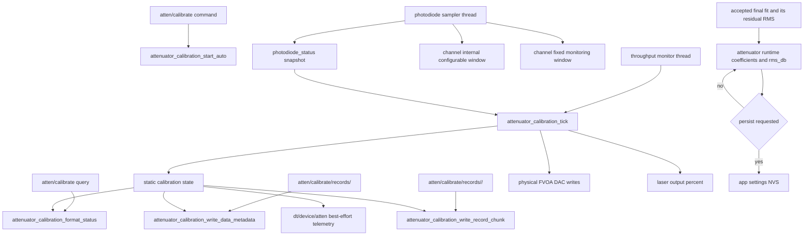
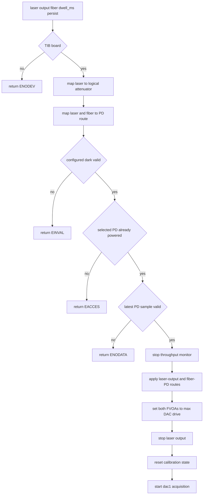
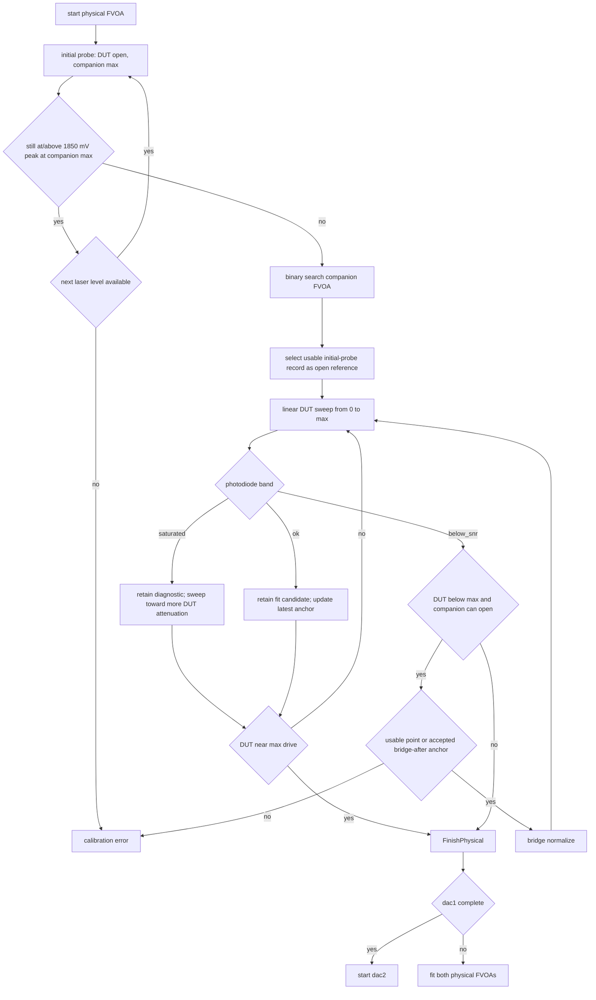
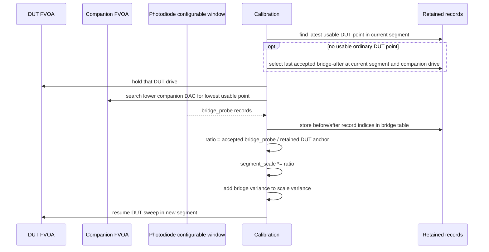
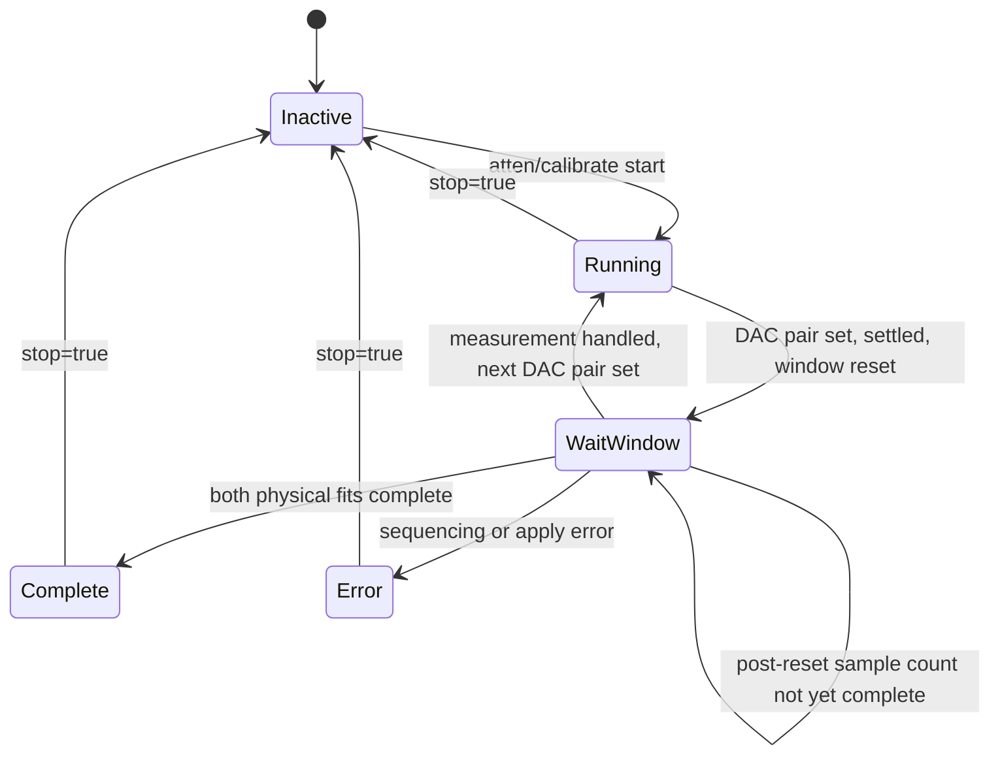
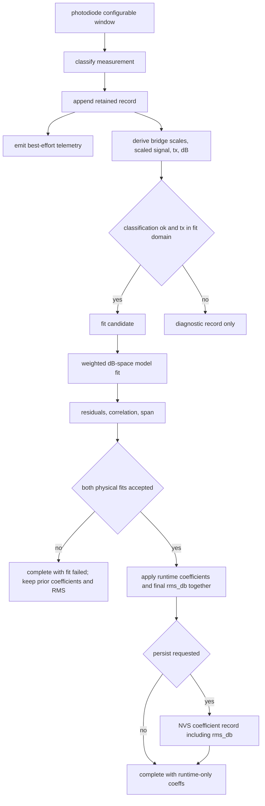

# Attenuator Calibration Flow

This page describes the current firmware implementation of automatic TIB FVOA
attenuator calibration. The lab rationale and model notes live in
`attenuator_calibration_lab_notes.md`; this page documents the firmware command,
state, telemetry, and retained-record flow.

Calibration is intentionally measurement driven. It does not use datasheet
voltage schedules, target photodiode voltages, fixed optical volumes, or other
preselected optical limits. The firmware finds usable regions from observed
photodiode saturation and SNR, retains every acquisition record, and fits only
records that are valid for the current attenuator model.

## Ownership



The photodiode module owns ADC reads, current samples, moving windows, and dark
snapshots. The calibration module owns sequencing, retained records, bridge
normalization, fitting, and coefficient application. The throughput monitor
thread advances calibration so no second photodiode worker or calibration
worker exists.

## Start Sequence



Automatic calibration does not power the photodiode or wait for a private
photodiode settle phase. The selected photodiode must already be on and already
producing valid sampler data. After setting both DACs for a measurement,
calibration waits 100 ms for FVOA settling, then resets the PD configurable
window. The PD owner rounds `dwell_ms` to whole samples;
calibration waits for that many post-reset conversion attempts.

Dark handling is separate from attenuator calibration. The calibration reads
the configured dark-subtracted photodiode configurable window; it does not
measure, update, or infer a private dark.

## Per-Point Measurement

```mermaid
sequenceDiagram
  participant Cal as Calibration
  participant Att as FVOA DACs
  participant PD as Photodiode sampler
  participant Rec as Retained records

  Cal->>Att: set swept and companion DAC voltages
  Cal->>Cal: sleep 100 ms for FVOA settling
  Cal->>PD: reset configurable window for dwell_ms
  PD->>PD: exclude in-flight old conversion; fill rounded sample count
  PD-->>Cal: completed current window
  Cal->>Cal: check owner health; classify raw maximum and SNR
  Cal->>Rec: append point/probe/bridge record
  Cal-->>Cal: schedule next point or fit
```

After both DAC writes succeed, calibration sleeps for `ATTEN_CAL_SETTLE_MS`
(100 ms), allowing for the FVOAs' response time of up to 60 ms. The PD then
resets its current configurable window and excludes any conversion begun before
reset. Calibration waits for the full requested sample count and a result newer
than that reset, including failed conversion attempts in the count. Settling is
additional to `dwell_ms`: a 550 ms averaging window still collects 11 samples
after the wait. Calibration reads the current window, not the last closed window.

The sleep holds the calibration mutex and pauses its calling thread, normally
the throughput monitor, delaying throughput processing and calibration
status/stop access during that interval. The ADC sampler continues independently.
This wait applies to initial probes, ordinary sweep points, and bridge probes.
The window supplies:

- raw mean millivolts,
- dark-subtracted mean millivolts,
- raw RMS,
- propagated net-mean error,
- failed sample count,
- min/max and max raw code.

The sampler's step detection snapshots the current configurable window into the
last configurable window without resetting the current rolling window.
Calibration normally ignores the last window because it represents a prior
optical level.

## Usable-Band Model

The acquisition logic treats photodiode readings as a band:

- `saturated`: at least one valid raw reading reaches the manufacturer's
  **2000 mV photodiode saturation/linearity limit**, expressed at the ADC input
  after the divider, so the window cannot supply an unbiased calibration ratio;
- `ok`: the dark-subtracted mean is positive and has enough SNR;
- `below_snr`: the optical signal is too dim for a useful fitted point.

The photodiode limit is not an output-voltage clamp: the detector can produce
voltages beyond it and beyond the ADC range. The separate ADC clipping boundary
is **2048 mV** full scale, with a maximum reported code of **2047.9375 mV**.
Calibration therefore rejects photodiode saturation before the ADC clips.

These are not interchangeable failure modes. A saturated DUT sweep sample is
retained as a diagnostic record and the sweep continues toward more DUT
attenuation. A below-SNR DUT sweep sample marks the dim edge of the current
segment and starts bridge normalization from the latest retained usable anchor.

For the companion FVOA the DAC direction must be read carefully: lower companion
DAC opens the companion and raises photodiode signal; higher companion DAC
attenuates more. Companion searches maintain a low-DAC too-bright side, a
more-attenuated high-DAC side, and the lowest usable companion DAC candidate
whose raw window maximum is below **1850 mV** (`ATTEN_CAL_SEARCH_MAX_MV`).
This search target leaves headroom for fluctuations and increased transmission
later in the sweep. It does not change the **2000 mV photodiode** saturation classification:
a usable record between these limits remains `ok` but is not a search candidate.
Initial-reference and bridge searches, including their fallback/recovery paths,
use the same target.

## Per-Physical Acquisition

Each logical attenuator has two physical FVOAs. Calibration runs the same
sequence for `dac1` and then `dac2`.



The initial probe protects the photodiode by starting with the companion FVOA
at maximum attenuation. If even that reaches the 1850 mV peak target, firmware
retries with lower laser output levels. The companion binary search finds the most open
companion setting with usable SNR and a raw window maximum below the target.

The selected open reference is a measured `initial_probe` record named by
metadata. Firmware does not append a separate reference copy and does not
repeat the measurement solely to confirm it. If the initial companion search
cannot find a usable candidate, the acquisition errors because no valid
normalization point exists for that physical FVOA.

The DUT sweep is linear and classification-aware. It starts at 0 mV and advances
by `ATTEN_CAL_SWEEP_STEP_MV` until full DAC drive. A usable point updates the
latest bridge anchor. A saturated point is too bright, so it also advances to
the next linear DUT step but is not a fit candidate and does not become a bridge
trigger. A below-SNR point marks the dim edge of the current segment. When that
dim edge appears before the DUT reaches full drive and the companion can still
open, firmware performs bridge normalization. The similarly named
`ATTEN_CAL_SEARCH_MIN_STEP_MV` is only the minimum bracket width for
companion-FVOA binary searches.

## Bridge Normalization



Because the DUT FVOA does not move during the bridge, the before/after
photodiode ratio measures only the change in companion transmission. The
before side is the latest usable retained `point` in the segment being closed.
If no such point exists, firmware uses the last accepted bridge's after record,
provided it is classified `ok`, belongs to the current segment, and has the
current companion DAC voltage. Other retained search probes are not eligible
for this fallback. Firmware logs the selected fallback record and DAC pair.
The after side is the accepted retained `bridge_probe` in the new segment.
Those record indices are stored in the bridge table rather than copied into
synthetic records. Later DUT measurements are divided by the cumulative segment
scale so all segments share the open-reference normalization.

If a bridge search cannot find a usable companion point, firmware either
tightens the too-bright-side search floor and keeps probing or finishes the
physical when the search demonstrates that the current bridge would add no more
useful attenuation range. A single below-SNR sweep point immediately after a
bridge does not establish the end of the physical range: the accepted
bridge-after record can anchor another search with the DUT held at its voltage.
If neither an ordinary point nor the accepted bridge-after record qualifies,
acquisition fails with `-ERANGE`. Reaching full DUT drive or an already fully
open companion still finishes the physical sweep.

## Tick State



The 100 ms settling sleep occurs inside measurement scheduling without a new
state-machine phase. `WaitWindow` then waits for the configured sample count in
the current internal photodiode configurable window.

## Records, Telemetry, and Fit



Every retained dataset is available through
`atten/calibrate/records/<dac1|dac2>` followed by numbered
`atten/calibrate/records/<dac1|dac2>/<chunk>` record chunks. The first response
contains HAC4 metadata: state, fit flags, record size, records per chunk,
record count, record chunk count, selected open-reference record, and bridge
before/after record indices. Each numbered chunk contains only raw records.
Telemetry on `dt/<device>/atten` is useful for live monitoring but is not the
authoritative dataset.

Saturation classification uses the raw window maximum reaching the 2000 mV
usable-input limit, before dark subtraction. A partly clipped window can have a
plausible mean and S/N while biasing normalization, so even an isolated overrange
reading excludes that window from references, bridge anchors, and fitting.
Saturated sweep records remain available for diagnosis and do not trigger bridge
normalization. Below-SNR sweep records trigger a bridge unless the DUT is
already at the end of the firmware drive range.

Retained records store raw acquisition facts only: `sweep_mv`, `other_mv`,
`laser_pct`, `signal_mv`, `signal_err_mv`, `max_mv`, `event`,
`classification`, and `segment`. The Python helper keeps those firmware names
and adds `fvoa_mv` and `other_fvoa_mv` as host-side plotting coordinates
derived from DAC millivolts and the default FVOA drive gain. Bridge scale,
scaled signal, relative transmission, dB attenuation, fit inclusion, and
residuals are computed from the raw records and accepted bridge boundaries
after acquisition.

The retained record events are:

| Event | Meaning |
| --- | --- |
| `point` | ordinary DUT sweep point |
| `initial_probe` | companion-search point before the open reference |
| `bridge_probe` | companion-search point during bridge normalization |

The open reference, bridge-before, and bridge-after roles are metadata indices
into these retained records. They are plotted as roles by host tools but are
not separate firmware event values.

The derived relative transmission for a fit point is:

```text
tx = signal_mv / (reference_signal_mv * segment_scale[segment])
```

with relative variance:

```text
(sigma_tx / tx)^2 =
    (signal_err_mv / signal_mv)^2
  + (reference_signal_err_mv / reference_signal_mv)^2
  + (sigma_segment_scale / segment_scale)^2
```

The fit minimizes uncertainty-weighted residuals in attenuator model dB output
space:

```text
measured_db = -10 * log10(tx)
max_atten_db = mean(measured_db for final three usable full-sweep points)
fit_points = usable voltage prefix including first measured_db > 55
floor_tx = 10^(-max_atten_db / 10)
model_tx = floor_tx + (1 - floor_tx) * ideal_model_tx
residual = model_db(dac_mv, fvoa_50pct_mv, slope_inv_fvoa_mv,
                    max_atten_db, gain)
         - measured_db
```

`max_atten_db` is the physical FVOA leakage floor, not the sum available from a
logical two-FVOA attenuator. Firmware estimates it from the final three usable
full-sweep points, propagates that uncertainty into the weighted dB residuals, and
then uses the restricted prefix to optimize only `fvoa_50pct_mv` and `slope_inv_fvoa_mv`.

The operating ceiling is `ATTENUATOR_CALIBRATED_MAX_DB` (55 dB per physical FVOA).
Fitting stays synchronous under the calibration mutex. The optimizer, correction
assembly/candidate checks, full-curve validation and scoring loops check a local
10 ms CPU budget between numerical evaluations and sleep for 1 ms when due.
This lets lower-priority UART RX and communication-health work run without
changing fit order, arithmetic, acceptance rules, priorities or health deadlines.
The sleep holds no hardware I/O lock. Other work on the throughput thread still
waits for the fit to finish; this is not asynchronous calibration.
Status queries read the last completed owner update through a separate short
mutex, so the fitter does not hold up Python polling. They retain `running` while
fitting and publish both final fit results together when fitting completes.
Start/stop and raw-record access still serialize with the calibration owner.

Acquisition still covers the complete voltage range. Both the base fit and the
optional Chebyshev correction use the same retained prefix, including the first
above-ceiling point so the boundary has measured support on both sides. The
correction keeps its full-floor coordinates and is not forced to zero at 55 dB:

```text
start_db = -10 * log10(0.99)
t = clamp((base_db - start_db) / (max_atten_db - start_db), 0, 1)
x = 2 * t - 1
correction_db = t * (1 - t) * sum(c_i * T_i(x))
model_db = base_db + correction_db
```

This correction is intentionally ringfenced from the three physical
coefficients. Its raw envelope is zero near open transmission and at the modeled
leakage floor. The fitter tries six leading terms, then five, down to one,
refitting the smaller normal equation each time and zeroing unused coefficient
slots. It keeps the first valid final curve. The base-only model is the last
fallback; no error-budget threshold or regularization parameter is introduced.

Every candidate receives its calibrated limit and continuation before validation.
Firmware checks finite, nonnegative, ordered values and nonnegative analytic slopes
on a 1 mV grid across the drive range, at retained fit voltages, and at the calibrated
join and its adjacent float voltages. This covers the open region even when clipping
left no fit points there. Increasing sampled values alone can hide a turn between
points. The grid is a numerical check, not a proof between its locations. Unused raw
polynomial behavior above the calibrated endpoint does not reject a valid continuation.

The installed `max_calibrated_db` is the minimum of 55 dB, the last supporting
measurement, its corrected-model prediction, and the leakage floor. It is separate
from `max_atten_db`, which still sets that inferred floor. The corresponding boundary
is recovered from the corrected curve; no cutoff voltage is persisted. Above it,
the polynomial is replaced by a fixed continuation, with `B` the base model, `L` its floor,
and `Bc + Cc = max_calibrated_db`:

```text
model_db = B + Cc * (L - B) / (L - Bc)
```

The value is continuous at the boundary and tends to the original floor.
The slope may have a corner. No blend width or additional fit parameter is
introduced. All-zero correction coefficients recover the base model exactly.
Forward evaluation, inverse commands and local sensitivities use this same
piecewise curve.

The final, unweighted `sqrt(sum(residual_db^2) / scored_count)` is installed as
`rms_db` with each accepted physical model. Correlation and maximum absolute
residual use the same scored points: fitting-support measurements whose **measured**
attenuation is within `max_calibrated_db`. The extra above-limit point constrains
the fit but does not enter these metrics. An in-range measurement with an
out-of-range prediction still contributes its full error. The reported `points`
and transmission/voltage spans describe all fitting support, including that anchor.

The same stored RMS remains in runtime uncertainty estimates, but it does not
establish accuracy above `max_calibrated_db`. It is not a parameter standard error
and is not divided by sqrt(point count) again. This can be conservative in regions
with smaller residuals.

Both physical fits must be accepted before installation. Failure leaves the
previous coefficients and their RMS unchanged. Persistence saves RMS with the
coefficient record; a new manual model without `rms_db` uses the 2 dB default.
Manual dB, linear and voltage commands retain access to the full drive range; attenuation above the
calibrated boundary is approximate. Autolevel bounds each device by the smaller
of its stored calibrated limit, the 55 dB ceiling and its reachable drive range.
It uses laser adjustment after reaching those limits.

The coefficient record now includes `max_calibrated_db`. Old attenuator NVS
records fail the existing size check and use built-in defaults until a new
calibration is installed. Other settings are preserved; there is no global
NVS reset or settings migration.

Runtime transmission uncertainty combines these model residuals with electrical
variation. For each device, `electrical_sigma_db = abs(d_db_d_voltage_mv) *
ATTENUATOR_FVOA_NOISE_RMS_MV / gain`. The constant defaults to 10 mV RMS measured
after the amplifier; zero recovers model-only uncertainty. The local derivative
includes the leakage floor and empirical correction. The pair uses
`total_sigma_db = hypot(hypot(rms1, rms2), hypot(electrical1, electrical2))`, then
`sigma_T = T * ln(10)/10 * total_sigma_db`.

Model and electrical contributions are assumed independent, as are the two
devices. Calibration error across repeated throughput samples remains correlated
and does not average away; independence between devices does not establish
temporal independence of electrical noise. This first-order static estimate
applies no frequency-response correction, and its combined uncertainty is not
temporal RMS variation. The throughput monitor combines it with laser uncertainty
and PD-only error; `tp_pd_err` remains PD-only. The [Python scope helper](api/attenuator_control.md#scope-noise-in-python)
reports model, electrical, and combined terms separately.

## Notebook Inspection

`tools/attenuator_calibration_lab.ipynb` is the lab-side inspection script for
this flow. It has two intentionally separate paths:

- the embedded path runs `atten_calibrate`, retrieves
  `atten_calibration_data`, and plots retained records, bridge events,
  residuals, and the coefficient-derived 2D attenuation surface;
- the manual exploration path directly calls `atten()`, sleeps for the
  configured dwell, and reads `pd()` so SNR, saturation, bridge, and fit
  thresholds can be changed quickly.

The manual path supports both the firmware-style weighted fit and a SciPy
least-squares exploratory fit. Its plots show propagated photodiode and
normalization uncertainty; coefficients should be reviewed before any
`atten_coeff(..., persist=True)` command is used.

An accepted coefficient object contains:

```json
{
  "fvoa_50pct_mv": 3144.95,
  "slope_inv_fvoa_mv": 0.00303104,
  "max_atten_db": 48.36,
  "gain": 1.533,
  "rms_db": 0.75,
  "correction_coeff": [0.12, -0.03, 0.01, 0.0, 0.0, 0.0]
}
```

## Power lifetime and correction validation

Calibration holds its selected PD's auto-off inhibition for acquisition, including
same-channel restart. It checks relay and source operational health before using
each completed window. Faults terminate acquisition and attempt laser shutdown;
a failed shutdown retains its identity for an explicit stop/restart. Numerical
fitting needs no PD power and releases inhibition when acquisition completes.

All six coefficients (`T0` through `T5`) participate in the basis, evaluator, and
analytic derivatives; reduced-order fits zero the unused high-order slots.
`atten_correction_rejected` summarizes a reduced-order or base-only result once per
physical device, including the selected term count and first failed check, voltage,
value and slope. The summary also goes to the local log. `terms=0` is base-only;
`terms=-1` means no valid candidate, including the base model. `fit=ok` indicates an
accepted final model and does not alone establish that optional correction was accepted; inspect its
coefficients and warnings. The earlier move to NVS schema 13 reset the old
four-term settings layout. The earlier calibrated-range update kept schema 13 and
rejected old attenuator records by size. This fitting change preserves the current
layout; recalibration is needed to obtain the new fits. Saved notebook
outputs remain historical captures; reload the host module after updating firmware.

### Compact calibration status

The aggregate status includes each model's coefficients, `max_calibrated_db`,
acceptance, point count, floor uncertainty, correlation, RMS and maximum error.
Diagnostic scalars use six significant digits and progress voltages three decimal
places; coefficient precision is retained. `min_tx`, `max_tx` and `fvoa_span_mv`
remain in the per-device fit telemetry but are omitted from aggregate status and
therefore are absent from newly fetched dataset metadata. This fits the existing
1024-byte response buffers without increasing queue storage.
