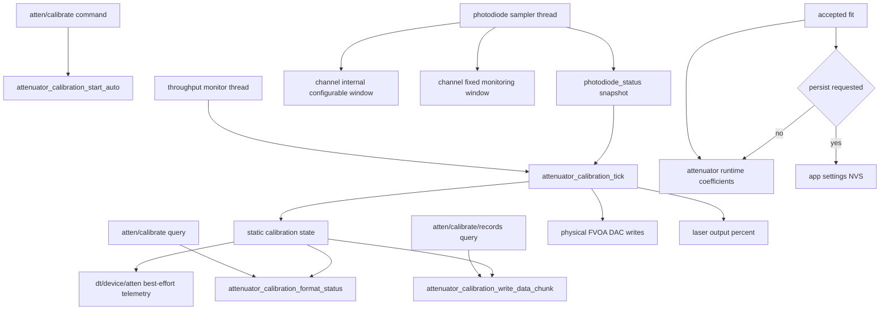
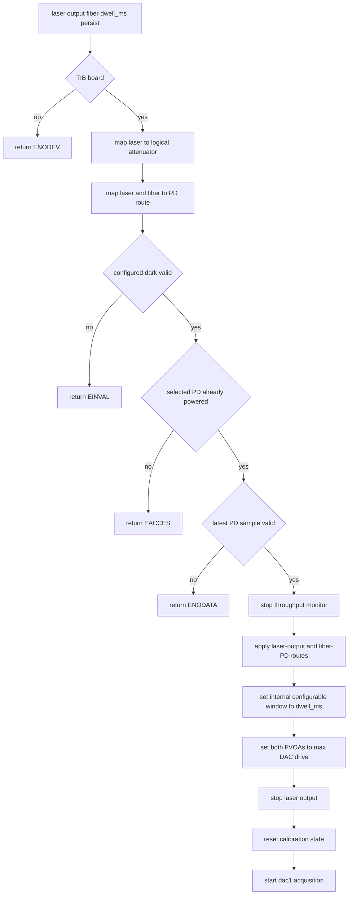
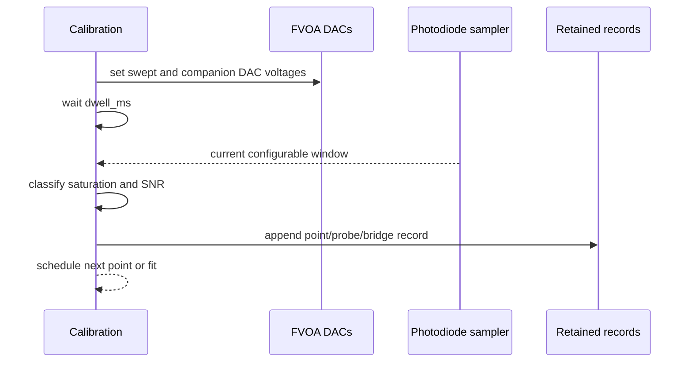
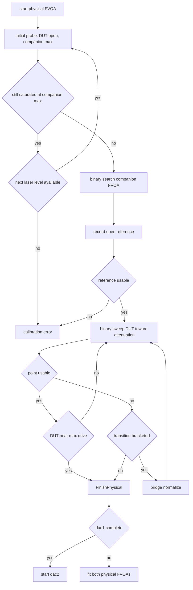
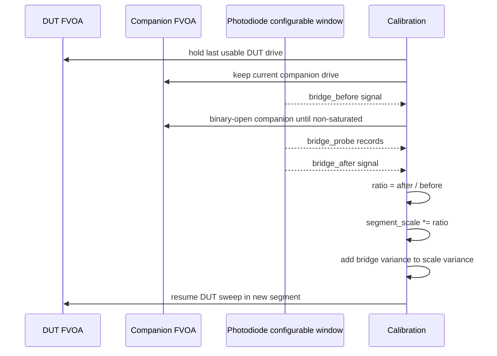
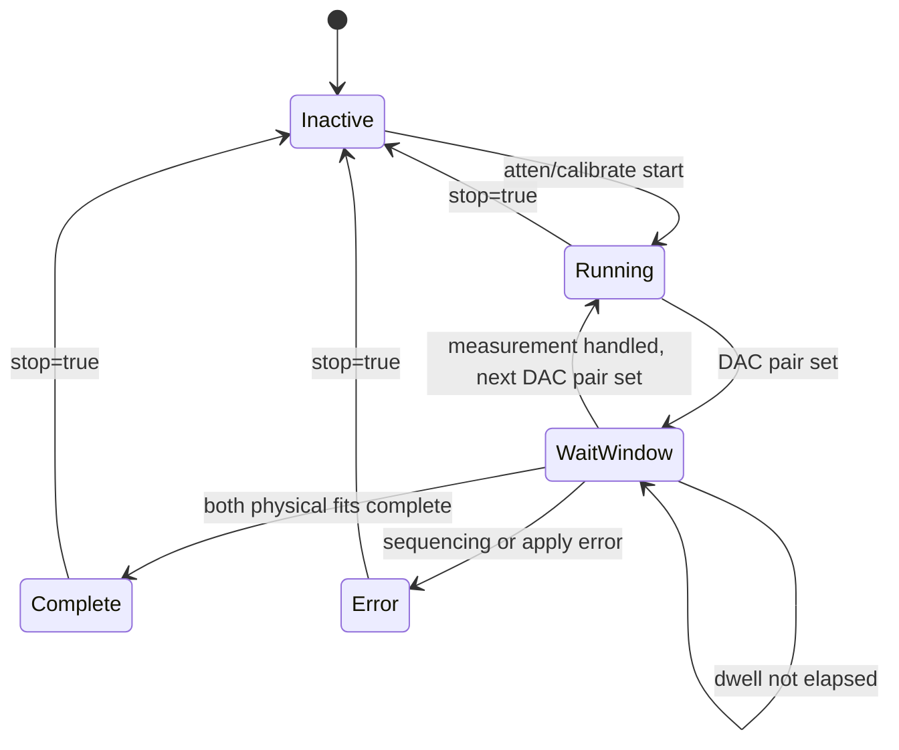
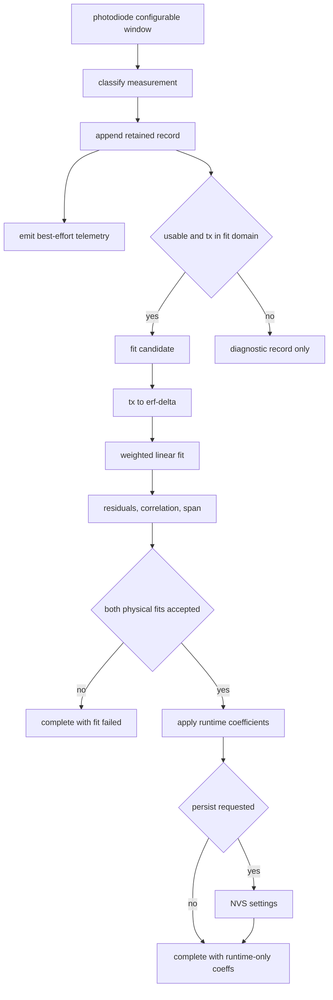

# Attenuator Calibration Flow

This page describes the current firmware implementation of automatic TIB FVOA
attenuator calibration. The lab rationale and model notes live in
`attenuator_calibration_lab_notes.md`; this page documents the firmware command,
state, telemetry, and retained-record flow.

Calibration is intentionally measurement driven. It does not use datasheet
voltage schedules, target photodiode voltages, fixed optical volumes, or other
preselected optical limits. The firmware finds usable regions from observed
photodiode saturation and SNR, retains every acquisition record, and fits only
records that are valid for the current attenuator model.

## Ownership



The photodiode module owns ADC reads, current samples, moving windows, and dark
snapshots. The calibration module owns sequencing, retained records, bridge
normalization, fitting, and coefficient application. The throughput monitor
thread advances calibration so no second photodiode worker or calibration
worker exists.

## Start Sequence



Automatic calibration does not power the photodiode or wait for a private
photodiode settle phase. The selected photodiode must already be on and already
producing valid sampler data. The command sets the photodiode internal
configurable-window duration to the calibration dwell and every subsequent
point waits that dwell after changing an attenuator.

Dark handling is separate from attenuator calibration. The calibration reads
the configured dark-subtracted photodiode configurable window; it does not
measure, update, or infer a private dark.

## Per-Point Measurement



The DAC write is followed by a dwell equal to the configured photodiode
configurable window. After the dwell, calibration reads the current
configurable window, not the last closed window. The window supplies:

- raw mean millivolts,
- dark-subtracted mean millivolts,
- raw RMS,
- propagated net-mean error,
- failed sample count,
- min/max and max raw code.

The sampler's step detection snapshots the current configurable window into the
last configurable window without resetting the current rolling window.
Calibration normally ignores the last window because it represents a prior
optical level.

## Per-Physical Acquisition

Each logical attenuator has two physical FVOAs. Calibration runs the same
sequence for `dac1` and then `dac2`.



The initial probe protects the photodiode by starting with the companion FVOA
at maximum attenuation. If even that clips the ADC, firmware retries with lower
laser output levels. The companion binary search then finds the most open
companion setting that is still non-saturated.

The DUT sweep is binary. A usable point extends the low side of the sweep; an
unusable point narrows the high side. When the sweep brackets the useful region
before the DUT reaches full drive, firmware performs bridge normalization
instead of discarding the remaining dynamic range.

## Bridge Normalization



Because the DUT FVOA does not move during the bridge, the before/after
photodiode ratio measures only the change in companion transmission. Later DUT
measurements are divided by the cumulative segment scale so all segments share
the open-reference normalization.

## Tick State



There is no separate photodiode-settle, DAC-settle, or photodiode-average
phase. The only active wait is the configured dwell for the current internal
photodiode configurable window.

## Records, Telemetry, and Fit



Every retained record is available through
`atten/calibrate/records/<dac1|dac2>[/<start>]` as a bounded binary HAC3 chunk.
Telemetry on `dt/<device>/atten` is useful for live monitoring but is not the
authoritative dataset.

The retained record events are:

| Event | Meaning |
| --- | --- |
| `point` | open reference or ordinary DUT sweep point |
| `initial_probe` | companion-search point before the open reference |
| `bridge_before` | low-SNR edge before opening the companion |
| `bridge_probe` | companion binary-search point during bridge |
| `bridge_after` | accepted post-bridge normalization point |

The fit converts normalized transmission to the attenuator model coordinate:

```text
delta = erfinv(erf(4) - 2 * erf(4) * tx)
```

and fits:

```text
delta = slope_inv_fvoa_mv * (gain * dac_mv - fvoa_50pct_mv)
```

An accepted coefficient object contains:

```json
{
  "fvoa_50pct_mv": 3144.95,
  "slope_inv_fvoa_mv": 0.00303104,
  "gain": 1.533
}
```
