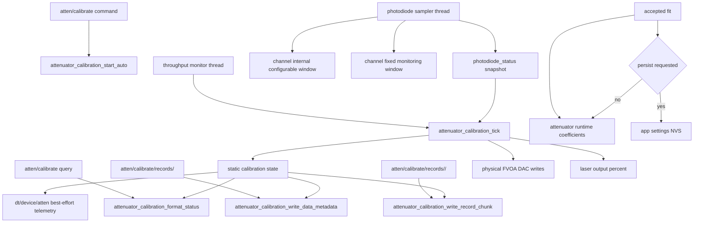
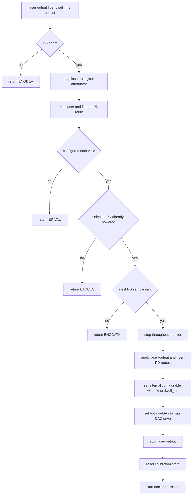
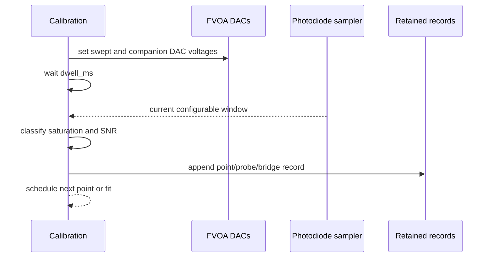
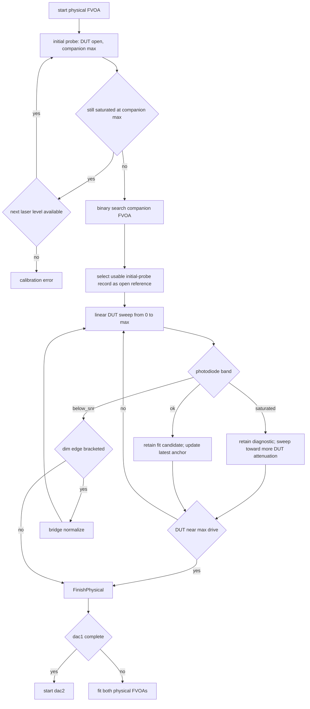
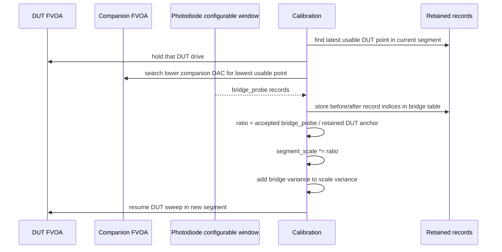
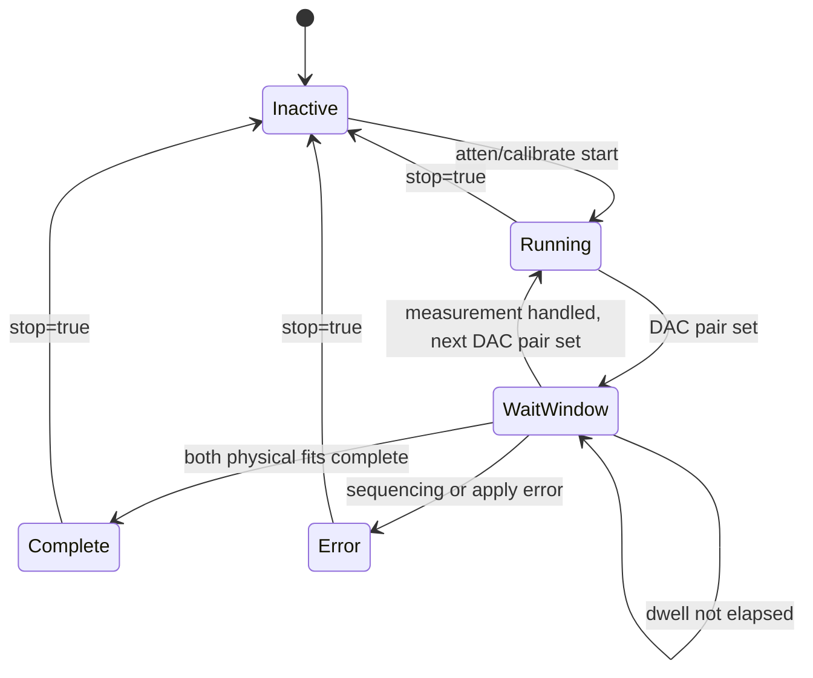
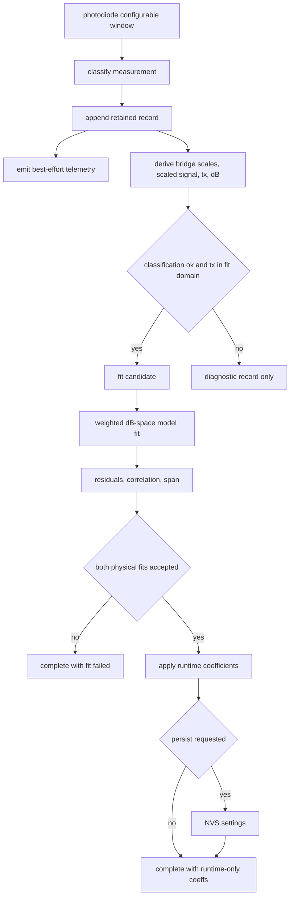

# Attenuator Calibration Flow

This page describes the current firmware implementation of automatic TIB FVOA
attenuator calibration. The lab rationale and model notes live in
`attenuator_calibration_lab_notes.md`; this page documents the firmware command,
state, telemetry, and retained-record flow.

Calibration is intentionally measurement driven. It does not use datasheet
voltage schedules, target photodiode voltages, fixed optical volumes, or other
preselected optical limits. The firmware finds usable regions from observed
photodiode saturation and SNR, retains every acquisition record, and fits only
records that are valid for the current attenuator model.

## Ownership



The photodiode module owns ADC reads, current samples, moving windows, and dark
snapshots. The calibration module owns sequencing, retained records, bridge
normalization, fitting, and coefficient application. The throughput monitor
thread advances calibration so no second photodiode worker or calibration
worker exists.

## Start Sequence



Automatic calibration does not power the photodiode or wait for a private
photodiode settle phase. The selected photodiode must already be on and already
producing valid sampler data. The command sets the photodiode internal
configurable-window duration to the calibration dwell and every subsequent
point waits that dwell after changing an attenuator.

Dark handling is separate from attenuator calibration. The calibration reads
the configured dark-subtracted photodiode configurable window; it does not
measure, update, or infer a private dark.

## Per-Point Measurement



The DAC write is followed by a dwell equal to the configured photodiode
configurable window. After the dwell, calibration reads the current
configurable window, not the last closed window. The window supplies:

- raw mean millivolts,
- dark-subtracted mean millivolts,
- raw RMS,
- propagated net-mean error,
- failed sample count,
- min/max and max raw code.

The sampler's step detection snapshots the current configurable window into the
last configurable window without resetting the current rolling window.
Calibration normally ignores the last window because it represents a prior
optical level.

## Usable-Band Model

The acquisition logic treats photodiode readings as a band:

- `saturated`: the photodiode mean is pinned at the ADC rail, so the optical
  signal is too bright;
- `ok`: the dark-subtracted mean is positive and has enough SNR;
- `below_snr`: the optical signal is too dim for a useful fitted point.

These are not interchangeable failure modes. A saturated DUT sweep sample is
retained as a diagnostic record and the sweep continues toward more DUT
attenuation. A below-SNR DUT sweep sample marks the dim edge of the current
segment and starts bridge normalization from the latest retained usable anchor.

For the companion FVOA the DAC direction must be read carefully: lower companion
DAC opens the companion and raises photodiode signal; higher companion DAC
attenuates more. Companion searches maintain a low-DAC saturated side, a
more-attenuated high-DAC side, and the lowest usable companion DAC candidate.
That candidate is the highest non-saturated photodiode signal found by the
bounded search.

## Per-Physical Acquisition

Each logical attenuator has two physical FVOAs. Calibration runs the same
sequence for `dac1` and then `dac2`.



The initial probe protects the photodiode by starting with the companion FVOA
at maximum attenuation. If even that clips the ADC, firmware retries with lower
laser output levels. The companion binary search then finds the most open
companion setting that is still non-saturated.

The selected open reference is a measured `initial_probe` record named by
metadata. Firmware does not append a separate reference copy and does not
repeat the measurement solely to confirm it. If the initial companion search
cannot find a usable candidate, the acquisition errors because no valid
normalization point exists for that physical FVOA.

The DUT sweep is linear and classification-aware. It starts at 0 mV and advances
by `ATTEN_CAL_SWEEP_STEP_MV` until full DAC drive. A usable point updates the
latest bridge anchor. A saturated point is too bright, so it also advances to
the next linear DUT step but is not a fit candidate and does not become a bridge
trigger. A below-SNR point marks the dim edge of the current segment. When that
dim edge appears before the DUT reaches full drive, firmware performs bridge
normalization instead of discarding the remaining dynamic range. The similarly
named `ATTEN_CAL_SEARCH_MIN_STEP_MV` is only the minimum bracket width for
companion-FVOA binary searches.

## Bridge Normalization



Because the DUT FVOA does not move during the bridge, the before/after
photodiode ratio measures only the change in companion transmission. The
before side is the latest usable retained `point` in the segment being closed.
The after side is the accepted retained `bridge_probe` in the new segment.
Those record indices are stored in the bridge table rather than copied into
synthetic records. Later DUT measurements are divided by the cumulative segment
scale so all segments share the open-reference normalization.

If a bridge search cannot find a usable companion point, firmware either
tightens the saturated-side search floor and keeps probing or finishes the
physical when the search demonstrates that the current bridge would add no more
useful attenuation range. A missing bridge anchor means the current segment has
no usable sweep point; after a bridge, a single immediately below-SNR point is
treated as the natural end of the physical sweep rather than an acquisition
error.

## Tick State



There is no separate photodiode-settle, DAC-settle, or photodiode-average
phase. The only active wait is the configured dwell for the current internal
photodiode configurable window.

## Records, Telemetry, and Fit



Every retained dataset is available through
`atten/calibrate/records/<dac1|dac2>` followed by numbered
`atten/calibrate/records/<dac1|dac2>/<chunk>` record chunks. The first response
contains HAC4 metadata: state, fit flags, record size, records per chunk,
record count, record chunk count, selected open-reference record, and bridge
before/after record indices. Each numbered chunk contains only raw records.
Telemetry on `dt/<device>/atten` is useful for live monitoring but is not the
authoritative dataset.

Saturation classification is based on the photodiode window mean reaching the
ADC rail. Window extrema are diagnostic only, since electrical and optical noise
can produce isolated rail excursions without pinning the diode. Saturated sweep
records are retained but are not fit candidates and do not trigger bridge
normalization. Below-SNR sweep records trigger a bridge unless the DUT is
already at the end of the firmware drive range.

Retained records store raw acquisition facts only: `sweep_mv`, `other_mv`,
`laser_pct`, `signal_mv`, `signal_err_mv`, `max_mv`, `event`,
`classification`, and `segment`. The Python helper keeps those firmware names
and adds `fvoa_mv` and `other_fvoa_mv` as host-side plotting coordinates
derived from DAC millivolts and the default FVOA drive gain. Bridge scale,
scaled signal, relative transmission, dB attenuation, fit inclusion, and
residuals are computed from the raw records and accepted bridge boundaries
after acquisition.

The retained record events are:

| Event | Meaning |
| --- | --- |
| `point` | ordinary DUT sweep point |
| `initial_probe` | companion-search point before the open reference |
| `bridge_probe` | companion-search point during bridge normalization |

The open reference, bridge-before, and bridge-after roles are metadata indices
into these retained records. They are plotted as roles by host tools but are
not separate firmware event values.

The derived relative transmission for a fit point is:

```text
tx = signal_mv / (reference_signal_mv * segment_scale[segment])
```

with relative variance:

```text
(sigma_tx / tx)^2 =
    (signal_err_mv / signal_mv)^2
  + (reference_signal_err_mv / reference_signal_mv)^2
  + (sigma_segment_scale / segment_scale)^2
```

The fit minimizes uncertainty-weighted residuals in attenuator model dB output
space:

```text
measured_db = -10 * log10(tx)
max_atten_db = mean(measured_db for final three fit points)
floor_tx = 10^(-max_atten_db / 10)
model_tx = floor_tx + (1 - floor_tx) * ideal_model_tx
residual = model_db(dac_mv, fvoa_50pct_mv, slope_inv_fvoa_mv,
                    max_atten_db, gain)
         - measured_db
```

`max_atten_db` is the physical FVOA leakage floor, not the sum available from a
logical two-FVOA attenuator. Firmware estimates it from the final three usable
fit points, propagates that uncertainty into the weighted dB residuals, and
then optimizes only `fvoa_50pct_mv` and `slope_inv_fvoa_mv`.

After the base fit, firmware fits an optional four-term Chebyshev correction to
the remaining dB residuals:

```text
start_db = -10 * log10(0.99)
t = clamp((base_db - start_db) / (max_atten_db - start_db), 0, 1)
x = 2 * t - 1
correction_db = t * (1 - t) * sum(c_i * T_i(x))
model_db = base_db + correction_db
```

This correction is intentionally ringfenced from the three physical
coefficients. It is zero near open transmission and at the modeled leakage
floor, and it is accepted only if the corrected model remains monotonic on the
actual sweep-point grid. If the residual solve is ill-conditioned or fails that
monotonicity check, firmware leaves `correction_coeff` as all zeros and keeps
the base fit.

## Notebook Inspection

`tools/attenuator_calibration_lab.ipynb` is the lab-side inspection script for
this flow. It has two intentionally separate paths:

- the embedded path runs `atten_calibrate_auto`, retrieves
  `atten_calibration_data`, and plots retained records, bridge events,
  residuals, and the coefficient-derived 2D attenuation surface;
- the manual exploration path directly calls `atten()`, sleeps for the
  configured dwell, and reads `pd()` so SNR, saturation, bridge, and fit
  thresholds can be changed quickly.

The manual path supports both the firmware-style weighted fit and a SciPy
least-squares exploratory fit. Its plots show propagated photodiode and
normalization uncertainty; coefficients should be reviewed before any
`set_atten_coeff(..., persist=True)` command is used.

An accepted coefficient object contains:

```json
{
  "fvoa_50pct_mv": 3144.95,
  "slope_inv_fvoa_mv": 0.00303104,
  "max_atten_db": 48.36,
  "gain": 1.533,
  "correction_coeff": [0.12, -0.03, 0.01, 0.0]
}
```
