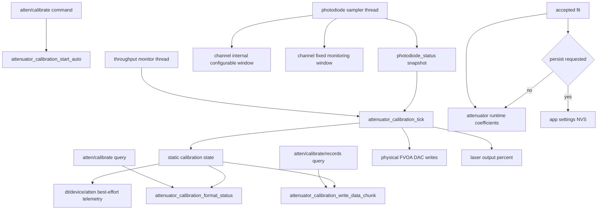
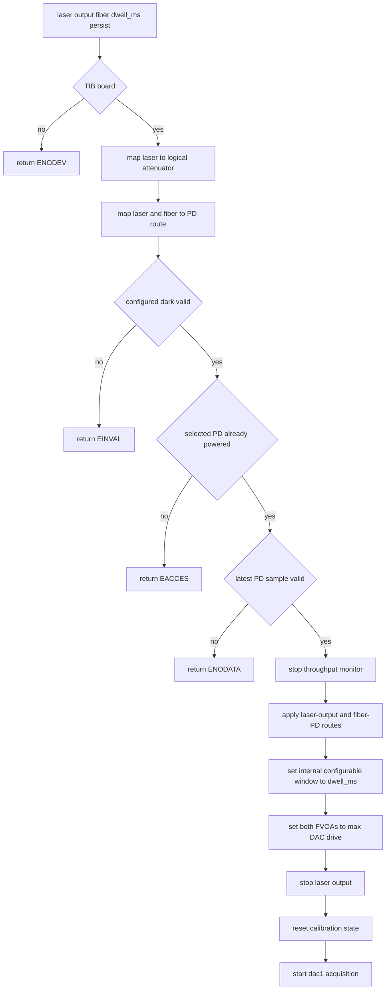
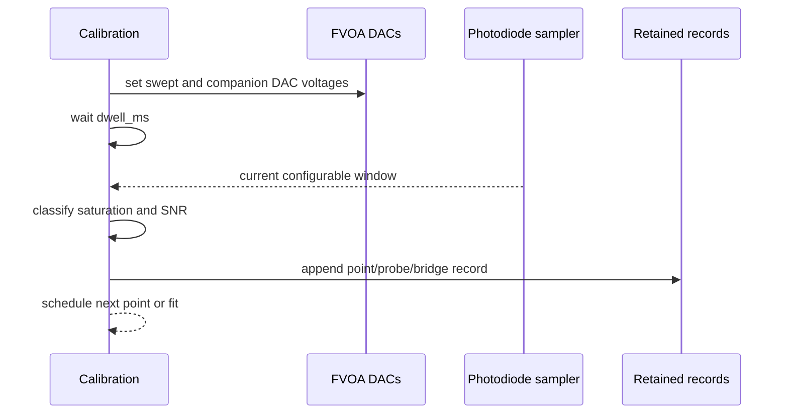
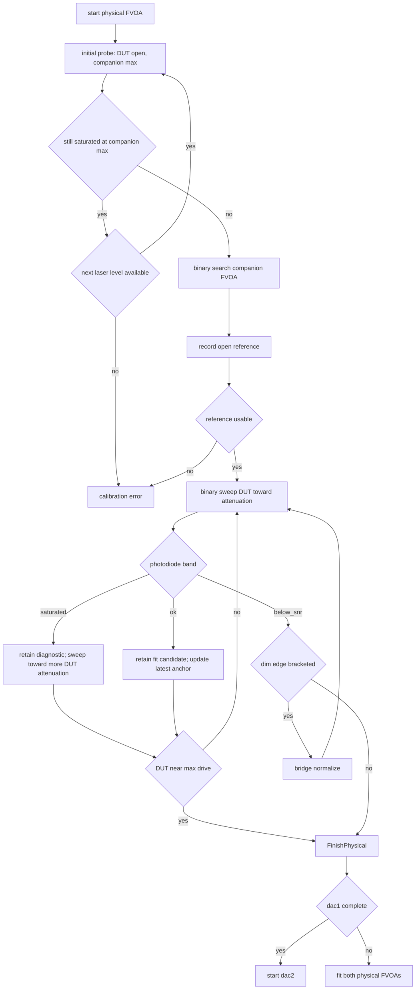
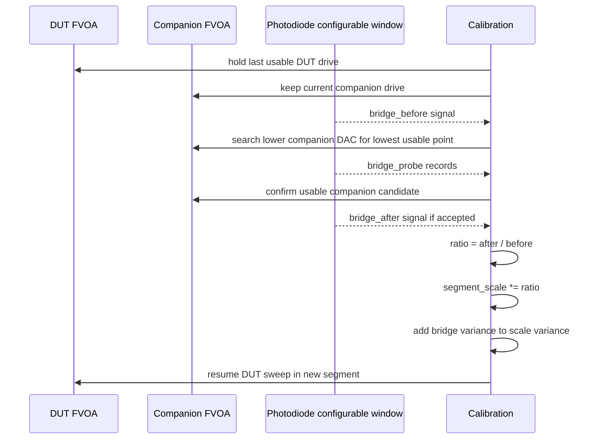
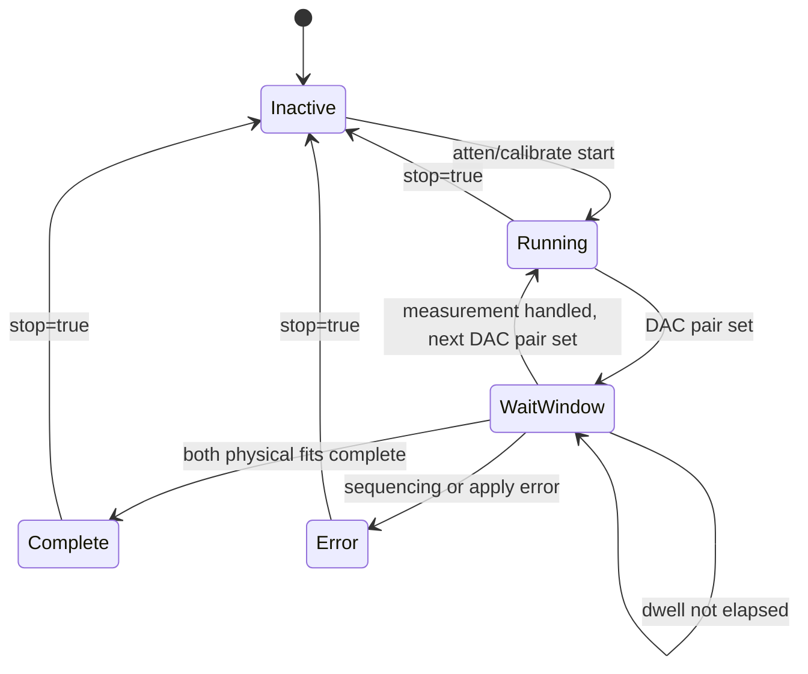
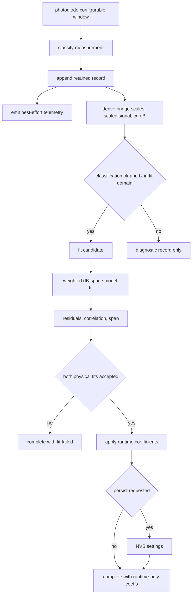

# Attenuator Calibration Flow

This page describes the current firmware implementation of automatic TIB FVOA
attenuator calibration. The lab rationale and model notes live in
`attenuator_calibration_lab_notes.md`; this page documents the firmware command,
state, telemetry, and retained-record flow.

Calibration is intentionally measurement driven. It does not use datasheet
voltage schedules, target photodiode voltages, fixed optical volumes, or other
preselected optical limits. The firmware finds usable regions from observed
photodiode saturation and SNR, retains every acquisition record, and fits only
records that are valid for the current attenuator model.

## Ownership



The photodiode module owns ADC reads, current samples, moving windows, and dark
snapshots. The calibration module owns sequencing, retained records, bridge
normalization, fitting, and coefficient application. The throughput monitor
thread advances calibration so no second photodiode worker or calibration
worker exists.

## Start Sequence



Automatic calibration does not power the photodiode or wait for a private
photodiode settle phase. The selected photodiode must already be on and already
producing valid sampler data. The command sets the photodiode internal
configurable-window duration to the calibration dwell and every subsequent
point waits that dwell after changing an attenuator.

Dark handling is separate from attenuator calibration. The calibration reads
the configured dark-subtracted photodiode configurable window; it does not
measure, update, or infer a private dark.

## Per-Point Measurement



The DAC write is followed by a dwell equal to the configured photodiode
configurable window. After the dwell, calibration reads the current
configurable window, not the last closed window. The window supplies:

- raw mean millivolts,
- dark-subtracted mean millivolts,
- raw RMS,
- propagated net-mean error,
- failed sample count,
- min/max and max raw code.

The sampler's step detection snapshots the current configurable window into the
last configurable window without resetting the current rolling window.
Calibration normally ignores the last window because it represents a prior
optical level.

## Usable-Band Model

The acquisition logic treats photodiode readings as a band:

- `saturated`: the photodiode mean is pinned at the ADC rail, so the optical
  signal is too bright;
- `ok`: the dark-subtracted mean is positive and has enough SNR;
- `below_snr`: the optical signal is too dim for a useful fitted point.

These are not interchangeable failure modes. A saturated DUT sweep sample is
retained as a diagnostic record and the sweep continues toward more DUT
attenuation. A below-SNR DUT sweep sample marks the dim edge of the current
segment and starts bridge normalization from the latest retained usable anchor.

For the companion FVOA the DAC direction must be read carefully: lower companion
DAC opens the companion and raises photodiode signal; higher companion DAC
attenuates more. Companion searches maintain a low-DAC saturated side, a
more-attenuated high-DAC side, and the lowest usable companion DAC candidate.
That candidate is the highest non-saturated photodiode signal found by the
bounded search.

## Per-Physical Acquisition

Each logical attenuator has two physical FVOAs. Calibration runs the same
sequence for `dac1` and then `dac2`.



The initial probe protects the photodiode by starting with the companion FVOA
at maximum attenuation. If even that clips the ADC, firmware retries with lower
laser output levels. The companion binary search then finds the most open
companion setting that is still non-saturated.

The DUT sweep is binary and classification-aware. A usable point updates the latest
bridge anchor and extends the lower side of the useful sweep. A saturated point
is too bright, so it also advances the search toward more DUT attenuation but is
not a fit candidate and does not become a bridge trigger. A below-SNR point narrows
the dim side of the sweep. When that dim edge is bracketed before the DUT
reaches full drive, firmware performs bridge normalization instead of discarding
the remaining dynamic range.

## Bridge Normalization



Because the DUT FVOA does not move during the bridge, the before/after
photodiode ratio measures only the change in companion transmission. Later DUT
measurements are divided by the cumulative segment scale so all segments share
the open-reference normalization.

If a bridge confirmation is saturated or below-SNR, that result is folded back
into the companion bracket and retained as a `bridge_probe`; it is not by itself
evidence that the swept-DUT anchor is bad. Swept-DUT backoff is reserved for
cases where `bridge_before` is unusable, the companion search cannot find a
useful candidate with real headroom, or bridge ratio validation remains
impossible after bounded probing.

## Tick State



There is no separate photodiode-settle, DAC-settle, or photodiode-average
phase. The only active wait is the configured dwell for the current internal
photodiode configurable window.

## Records, Telemetry, and Fit



Every retained record is available through
`atten/calibrate/records/<dac1|dac2>[/<start>]` as a bounded binary HAC4 chunk.
Telemetry on `dt/<device>/atten` is useful for live monitoring but is not the
authoritative dataset.

Saturation classification is based on the photodiode window mean reaching the
ADC rail. Window extrema are diagnostic only, since electrical and optical noise
can produce isolated rail excursions without pinning the diode. If a bridge
cannot be completed from the held DUT anchor after bounded companion probing,
the acquisition backs off to an earlier usable sweep point in the current
segment and overwrites the marginal retained records. The backoff is bounded by
the firmware constants for ADC-range fraction and by at most half of the current
segment's usable sweep points; each backoff emits live telemetry/logging so the
operator can see the discarded boundary attempts.

Retained records store raw acquisition facts only: `sweep_mv`, `other_mv`,
`laser_pct`, `signal_mv`, `signal_err_mv`, `max_mv`, `event`,
`classification`, and `segment`. The Python helper keeps those firmware names
and adds `fvoa_mv` and `other_fvoa_mv` as host-side plotting coordinates
derived from DAC millivolts and the default FVOA drive gain. Bridge scale,
scaled signal, relative transmission, dB attenuation, fit inclusion, and
residuals are computed from the raw records and accepted bridge boundaries
after acquisition.

The retained record events are:

| Event | Meaning |
| --- | --- |
| `point` | ordinary DUT sweep point |
| `initial_probe` | companion-search point before the open reference |
| `reference` | open reference that normalizes relative transmission |
| `bridge_before` | boundary repeat before opening the companion |
| `bridge_probe` | companion search point or failed bridge confirmation |
| `bridge_after` | accepted post-bridge normalization point |

The derived relative transmission for a fit point is:

```text
tx = signal_mv / (reference_signal_mv * segment_scale[segment])
```

with relative variance:

```text
(sigma_tx / tx)^2 =
    (signal_err_mv / signal_mv)^2
  + (reference_signal_err_mv / reference_signal_mv)^2
  + (sigma_segment_scale / segment_scale)^2
```

The fit minimizes uncertainty-weighted residuals in attenuator model dB output
space:

```text
measured_db = -10 * log10(tx)
residual = model_db(dac_mv, fvoa_50pct_mv, slope_inv_fvoa_mv, gain)
         - measured_db
```

## Notebook Inspection

`tools/attenuator_calibration_lab.ipynb` is the lab-side inspection script for
this flow. It has two intentionally separate paths:

- the embedded path runs `atten_calibrate_auto`, retrieves
  `atten_calibration_data`, and plots retained records, bridge events,
  residuals, and the coefficient-derived 2D attenuation surface;
- the manual exploration path directly calls `atten()`, sleeps for the
  configured dwell, and reads `pd()` so SNR, saturation, bridge, and fit
  thresholds can be changed quickly.

The manual path supports both the firmware-style weighted fit and a SciPy
least-squares exploratory fit. Its plots show propagated photodiode and
normalization uncertainty; coefficients should be reviewed before any
`set_atten_coeff(..., persist=True)` command is used.

An accepted coefficient object contains:

```json
{
  "fvoa_50pct_mv": 3144.95,
  "slope_inv_fvoa_mv": 0.00303104,
  "gain": 1.533
}
```
