# Firmware Diagrams

These Mermaid diagrams are implementation-derived snapshots of the current
firmware. They intentionally distinguish queueing, work items, and blocking
hardware calls.

## 1. System Overview

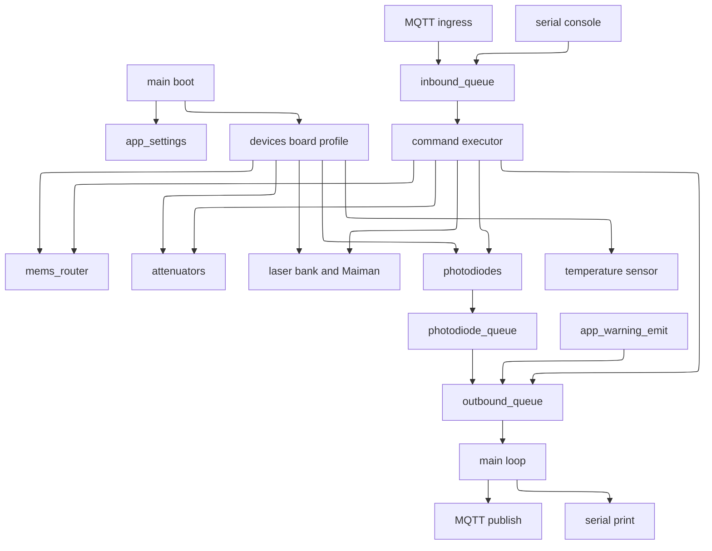

## 2. Boot Sequence

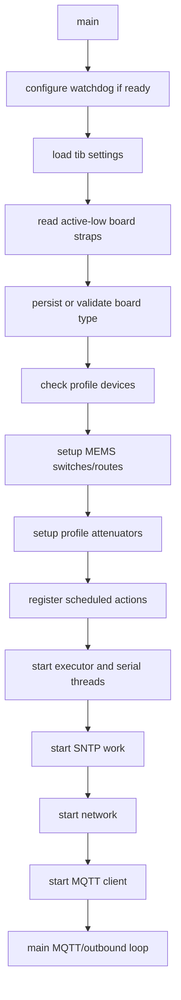

## 3. Main Loop, Network, and MQTT Processing

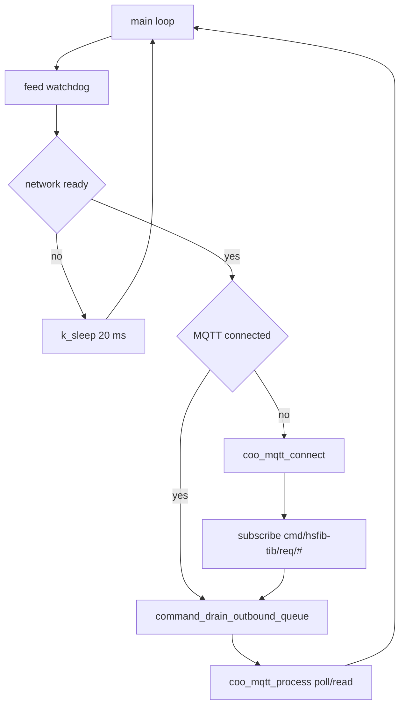

## 4. MQTT Command Ingress

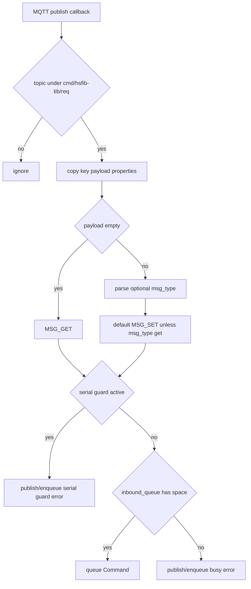

## 5. Serial Command Ingress

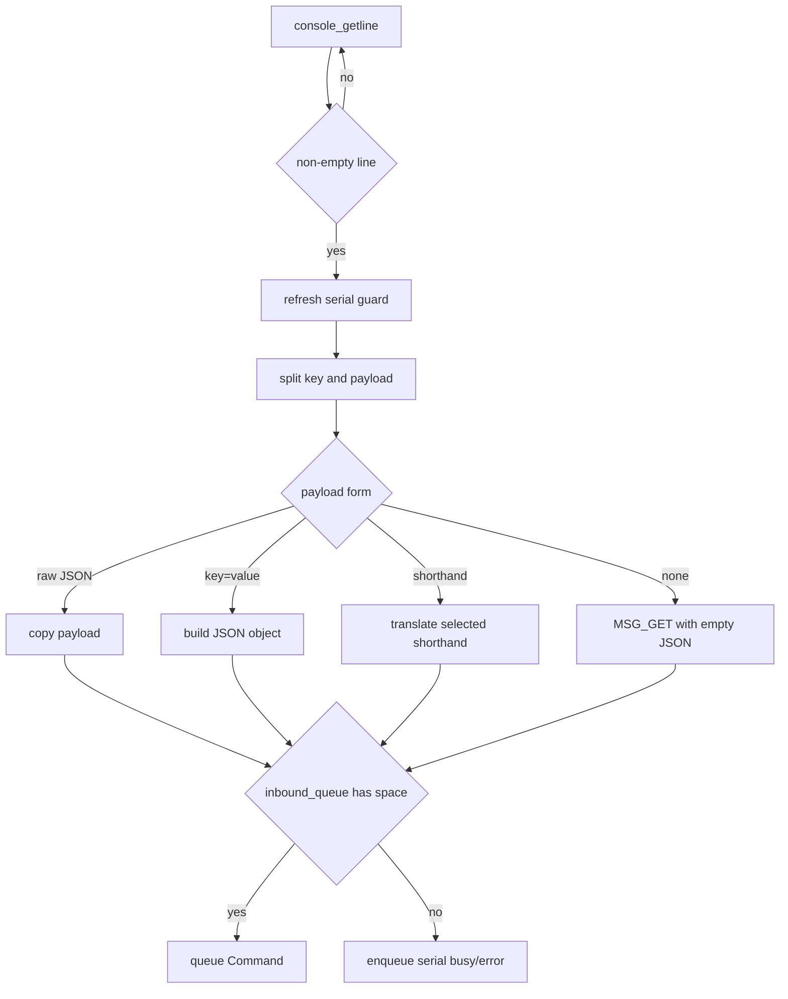

## 6. Common Command Executor Flow

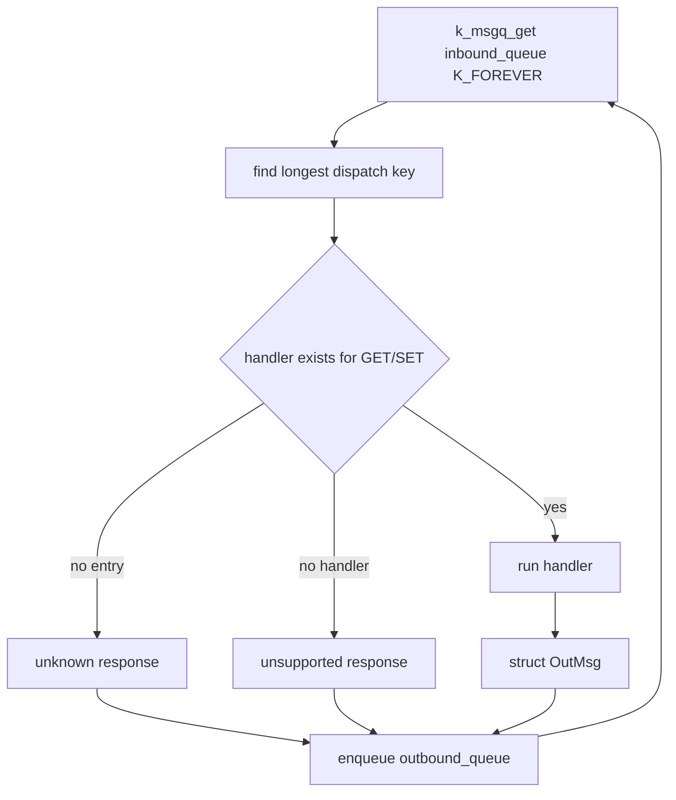

## 7. Outbound Response, Telemetry, and Warning Flow

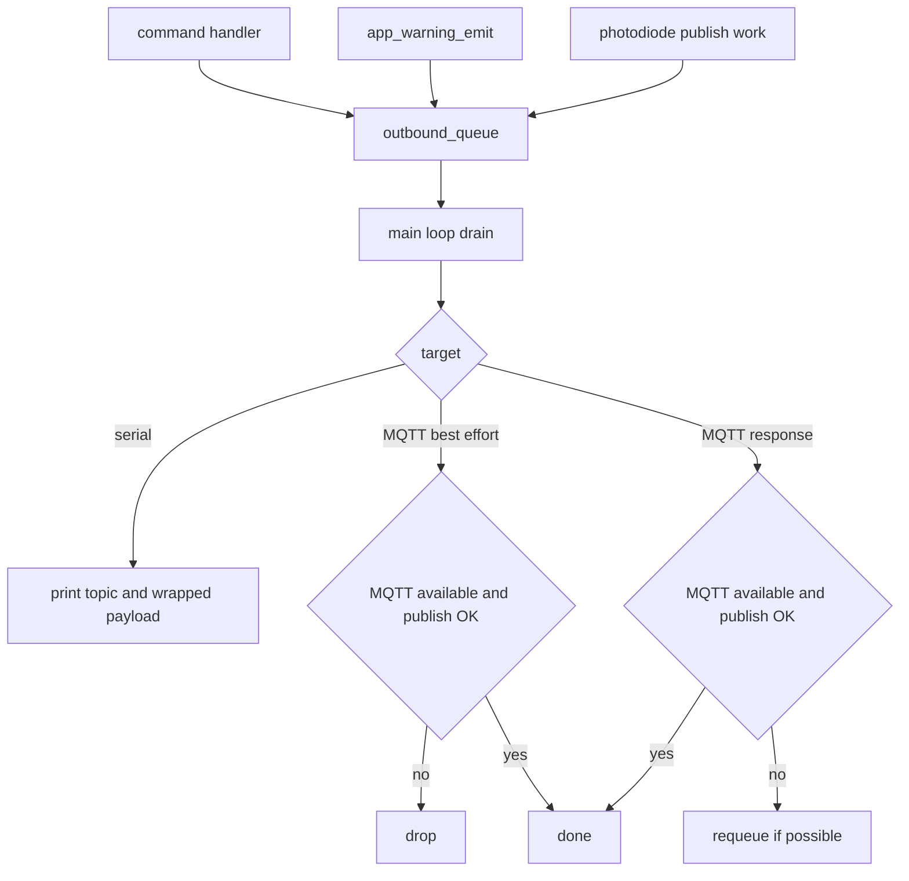

## 8. Serial Guard Delayed Action Flow

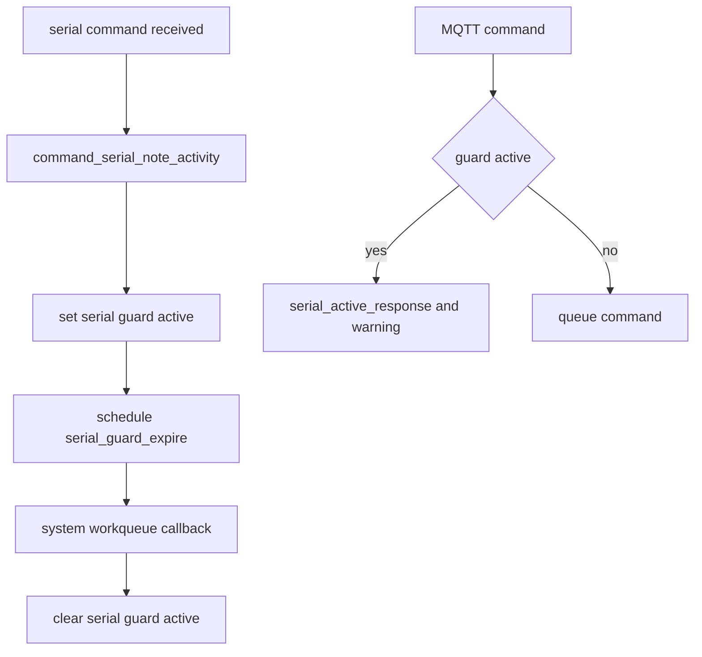

## 9. Scheduled Actions Architecture

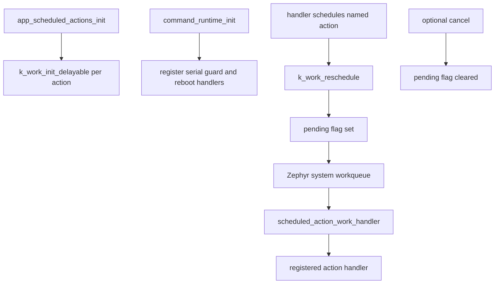

## 10. Photodiode Sampling and Dark Calibration Flow

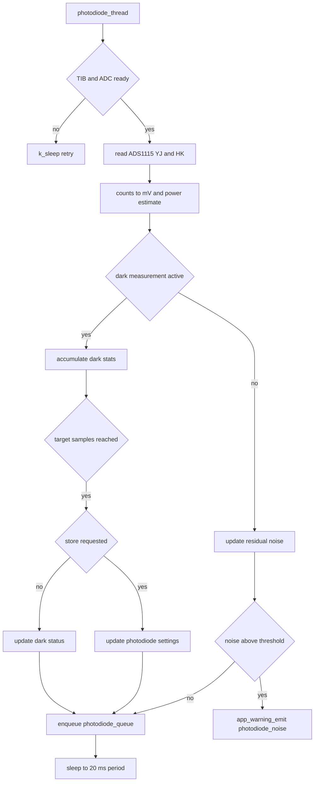

## 11. MEMS Router and Toggler Flow

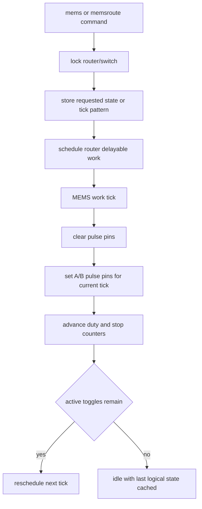

## 12. Split Command Flow

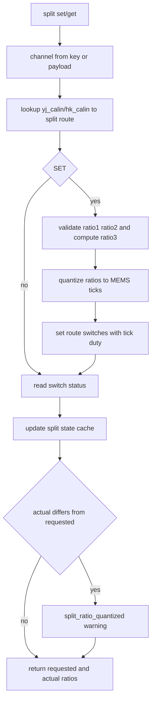

## 13. Settings Load, Update, and Persist Flow

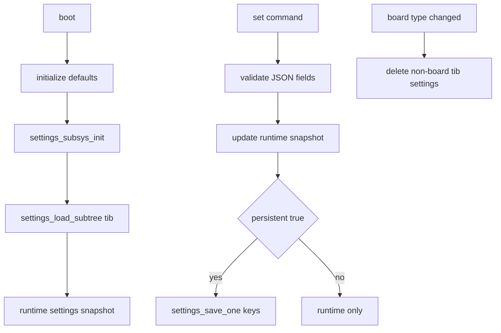

## 14. Warning Publication Flow

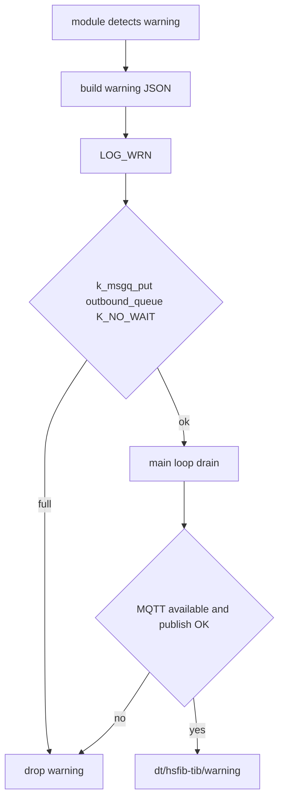

## 15. Temperature Sensing Flow

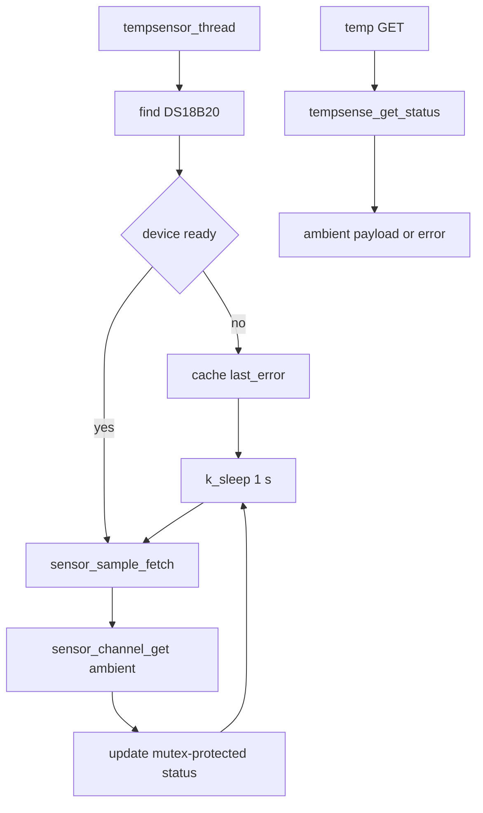

## 16. SNTP and Time Flow

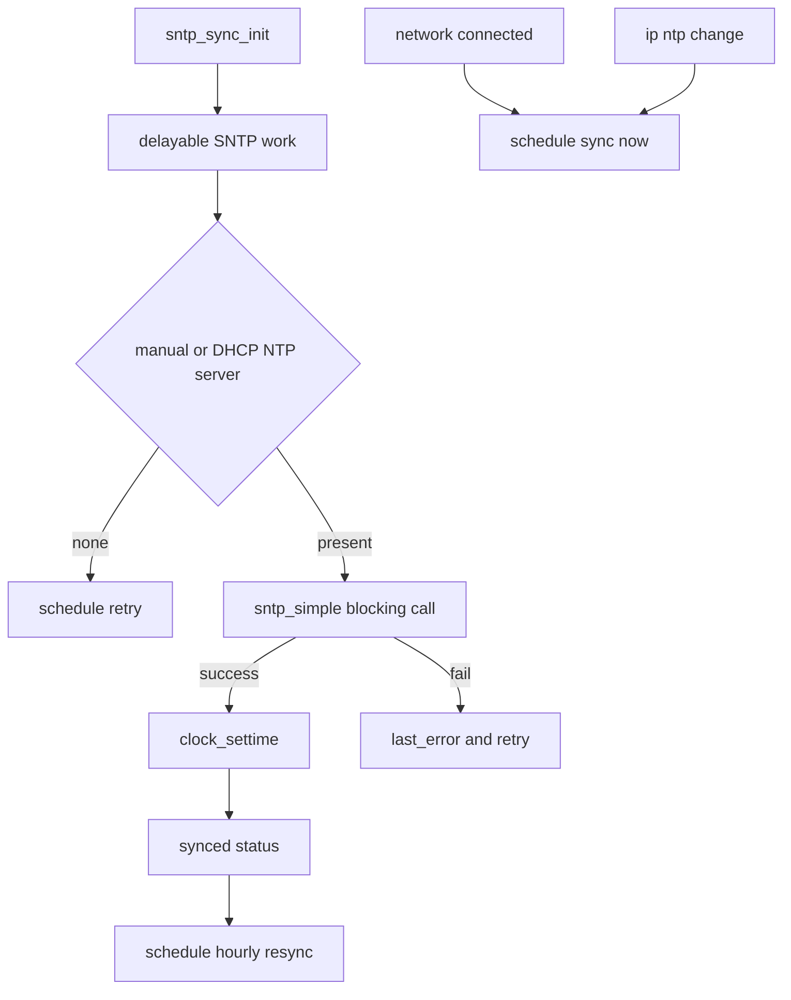

## 17. Watchdog Flow

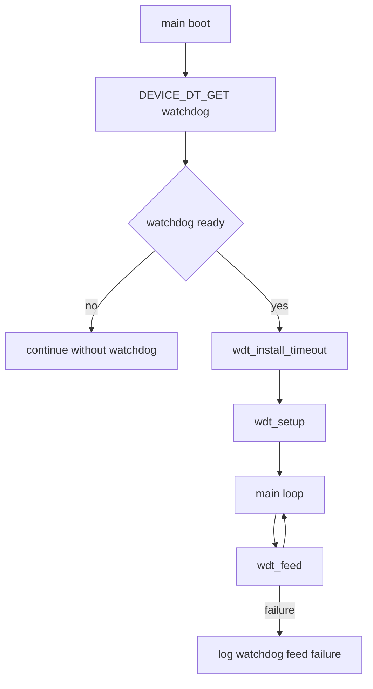
