# Firmware Diagrams

These Mermaid diagrams are implementation-derived snapshots of the current
firmware. They intentionally distinguish queueing, work items, and blocking
hardware calls.

## 1. System Overview

```mermaid
:config: {"layout": "elk"}

flowchart TD
  Boot[main boot] --> Settings[app_settings]
  Boot --> Devices[devices board profile]
  Devices --> MEMS[mems_router]
  Devices --> Atten[attenuators]
  Devices --> Laser[laser bank and Maiman]
  Devices --> PD[photodiodes]
  Devices --> TP[throughput_monitor]
  Devices --> Temp[temperature sensor]
  MQTT[MQTT ingress] --> InQ[inbound_queue]
  Serial[serial console] --> InQ
  InQ --> Exec[command executor]
  Exec --> MEMS
  Exec --> Atten
  Exec --> Laser
  Exec --> PD
  Exec --> TP
  Exec --> OutQ[outbound_queue]
  TP --> OutQ
  RuntimeEmit[coo_cmd_runtime_emit] --> OutQ
  OutQ --> MainLoop[main loop]
  MainLoop --> Broker[MQTT publish]
  MainLoop --> Console[serial print]
```

## 2. Boot Sequence

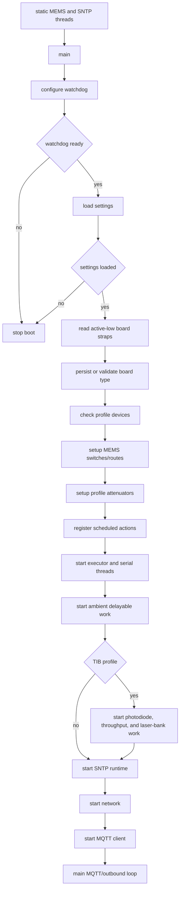
```mermaid
flowchart TD
  Static[static MEMS and SNTP threads] --> Start[main]
  Start --> Watchdog[configure watchdog]
  Watchdog --> WdogOK{watchdog ready}
  WdogOK -- no --> Stop[stop boot]
  WdogOK -- yes --> Load[load settings]
  Load --> SettingsOK{settings loaded}
  SettingsOK -- no --> Stop
  SettingsOK -- yes --> Straps[read active-low board straps]
  Straps --> PersistBoard[persist or validate board type]
  PersistBoard --> DevicesReady[check profile devices]
  DevicesReady --> Router[setup MEMS switches/routes]
  Router --> Attens[setup profile attenuators]
  Attens --> Runtime[register scheduled actions]
  Runtime --> Threads[start executor and serial threads]
  Threads --> Work[start ambient delayable work]
  Work --> TibActors{TIB profile}
  TibActors -- yes --> TibStart[start photodiode, throughput, and laser-bank work]
  TibActors -- no --> SNTP[start SNTP runtime]
  TibStart --> SNTP
  SNTP --> Network[start network]
  Network --> MQTTInit[start MQTT client]
  MQTTInit --> Loop[main MQTT/outbound loop]
```

## 3. Main Loop, Network, and MQTT Processing

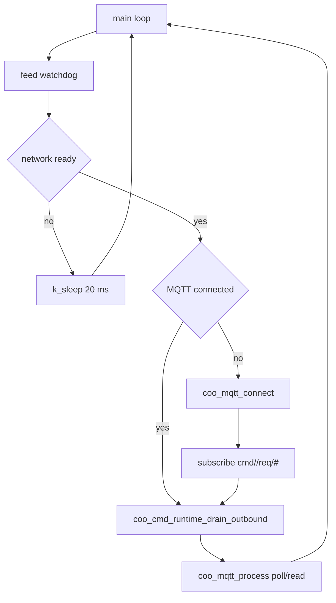
```mermaid
flowchart TD
  Loop[main loop] --> Feed[feed watchdog]
  Feed --> Ready{network ready}
  Ready -- no --> Sleep[k_sleep 20 ms]
  Ready -- yes --> Connected{MQTT connected}
  Connected -- no --> Connect[coo_mqtt_connect]
  Connected -- yes --> Drain[coo_cmd_runtime_drain_outbound]
  Connect --> Subscribe[subscribe cmd/<device>/req/#]
  Subscribe --> Drain
  Drain --> Process[coo_mqtt_process poll/read]
  Process --> Loop
  Sleep --> Loop
```

## 4. MQTT Command Ingress

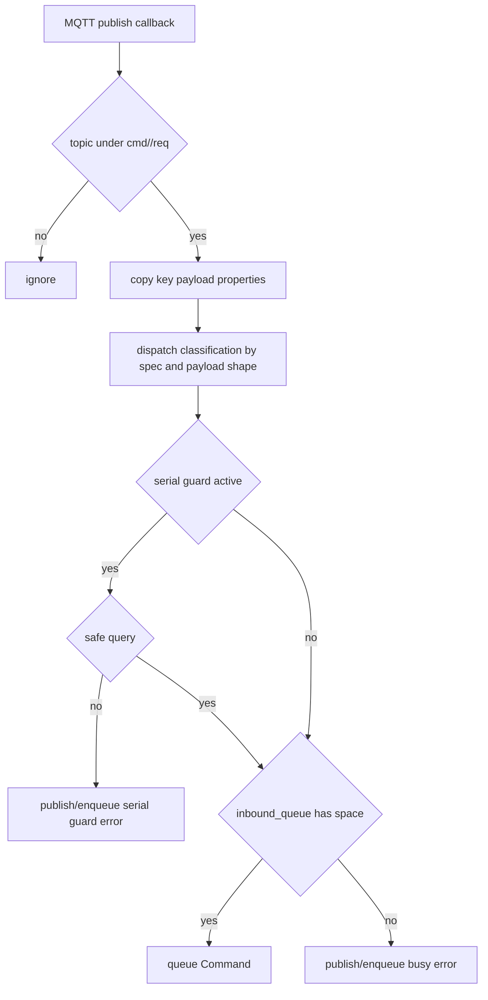
```mermaid
flowchart TD
  Pub[MQTT publish callback] --> Prefix{topic under cmd/<device>/req}
  Prefix -- no --> Drop[ignore]
  Prefix -- yes --> Copy[copy key payload properties]
  Copy --> Classify[dispatch classification by spec and payload shape]
  Classify --> Guard{serial guard active}
  Guard -- yes --> QueryAllowed{safe query}
  QueryAllowed -- no --> Reject[publish/enqueue serial guard error]
  QueryAllowed -- yes --> Enq{inbound_queue has space}
  Guard -- no --> Enq
  Enq -- yes --> Queue[queue Command]
  Enq -- no --> Busy[publish/enqueue busy error]
```

## 5. Serial Command Ingress

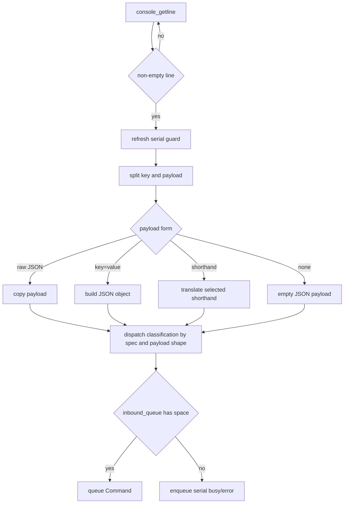
```mermaid
flowchart TD
  Console[console_getline] --> Line{non-empty line}
  Line -- no --> Console
  Line -- yes --> Guard[refresh serial guard]
  Guard --> Split[split key and payload]
  Split --> Payload{payload form}
  Payload -- none --> Empty[empty JSON payload]
  Payload -- raw JSON --> Copy[copy payload]
  Payload -- key=value --> KV[build JSON object]
  Payload -- shorthand --> Short[translate selected shorthand]
  Copy --> Classify[dispatch classification by spec and payload shape]
  KV --> Classify
  Short --> Classify
  Empty --> Classify
  Classify --> Queue{inbound_queue has space}
  Queue -- yes --> Enqueue[queue Command]
  Queue -- no --> Error[enqueue serial busy/error]
```

## 6. Common Command Executor Flow

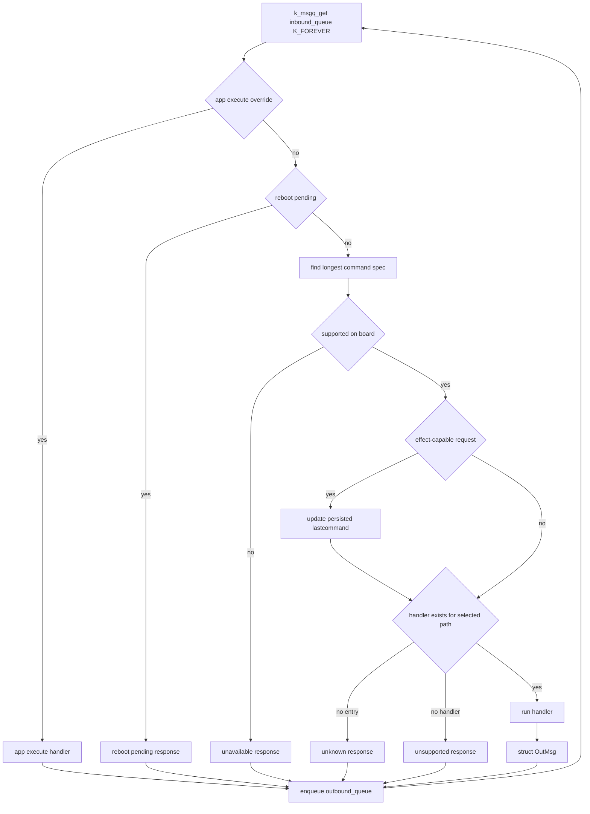
```mermaid
flowchart TD
  Wait[k_msgq_get inbound_queue K_FOREVER] --> Override{app execute override}
  Override -- yes --> AppExec[app execute handler]
  Override -- no --> Reboot{reboot pending}
  Reboot -- yes --> Busy[reboot pending response]
  Reboot -- no --> Dispatch[find longest command spec]
  Dispatch --> Supported{supported on board}
  Supported -- no --> Unavailable[unavailable response]
  Supported -- yes --> Record{effect-capable request}
  Record -- yes --> Last[update persisted lastcommand]
  Record -- no --> Found{handler exists for selected path}
  Last --> Found
  Found -- no entry --> Unknown[unknown response]
  Found -- no handler --> Unsupported[unsupported response]
  Found -- yes --> Handler[run handler]
  Handler --> Response[struct OutMsg]
  AppExec --> Out[enqueue outbound_queue]
  Busy --> Out
  Unknown --> Out[enqueue outbound_queue]
  Unavailable --> Out
  Unsupported --> Out
  Response --> Out
  Out --> Wait
```

## 7. Outbound Response, Telemetry, and Warning Flow

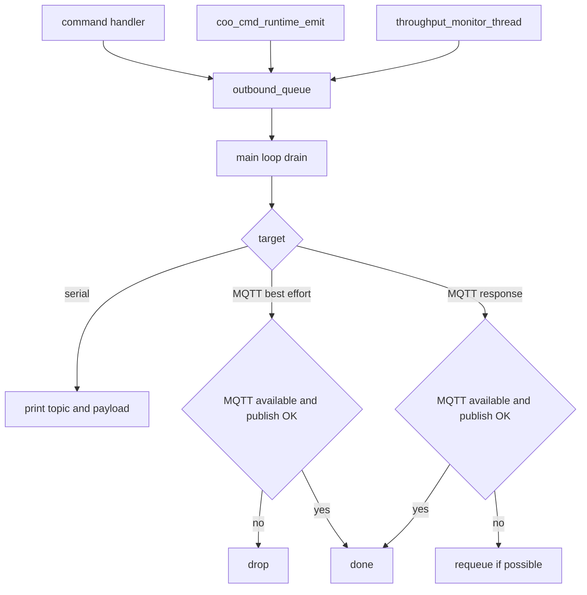
```mermaid
flowchart TD
  Handler[command handler] --> OutQ[outbound_queue]
  RuntimeEmit[coo_cmd_runtime_emit] --> OutQ
  Throughput[throughput_monitor_thread] --> OutQ
  OutQ --> Drain[main loop drain]
  Drain --> Target{target}
  Target -- serial --> Print[print topic and payload]
  Target -- MQTT best effort --> MQTTBE{MQTT available and publish OK}
  Target -- MQTT response --> MQTT{MQTT available and publish OK}
  MQTTBE -- no --> Drop[drop]
  MQTTBE -- yes --> Done[done]
  MQTT -- no --> Requeue[requeue if possible]
  MQTT -- yes --> Done
```

## 8. Serial Guard Delayed Action Flow

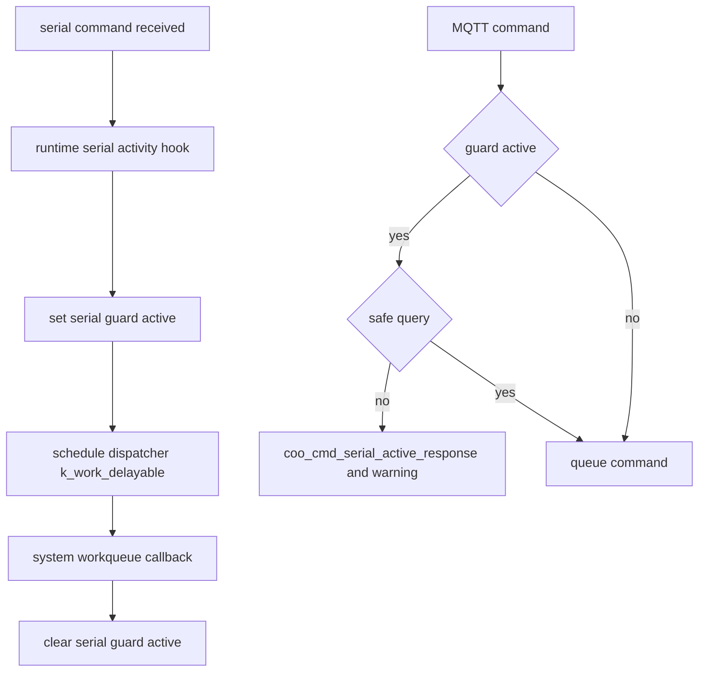
```mermaid
flowchart TD
  SerialLine[serial command received] --> Note[runtime serial activity hook]
  Note --> Active[set serial guard active]
  Active --> Schedule[schedule dispatcher k_work_delayable]
  MQTTCommand[MQTT command] --> Check{guard active}
  Check -- yes --> Safe{safe query}
  Safe -- no --> Reject[coo_cmd_serial_active_response and warning]
  Safe -- yes --> Queue[queue command]
  Check -- no --> Queue
  Schedule --> Expire[system workqueue callback]
  Expire --> Clear[clear serial guard active]
```

## 9. Delayable Work Ownership

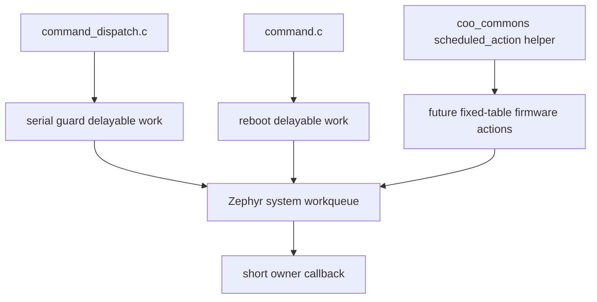
```mermaid
flowchart TD
  Dispatch[command_dispatch.c] --> Guard[serial guard delayable work]
  Command[command.c] --> Reboot[reboot delayable work]
  Commons[coo_commons scheduled_action helper] --> Future[future fixed-table firmware actions]
  Guard --> SysQ[Zephyr system workqueue]
  Reboot --> SysQ
  Future --> SysQ
  SysQ --> Expire[short owner callback]
```

## 10. Photodiode Sampling and Dark Calibration Flow

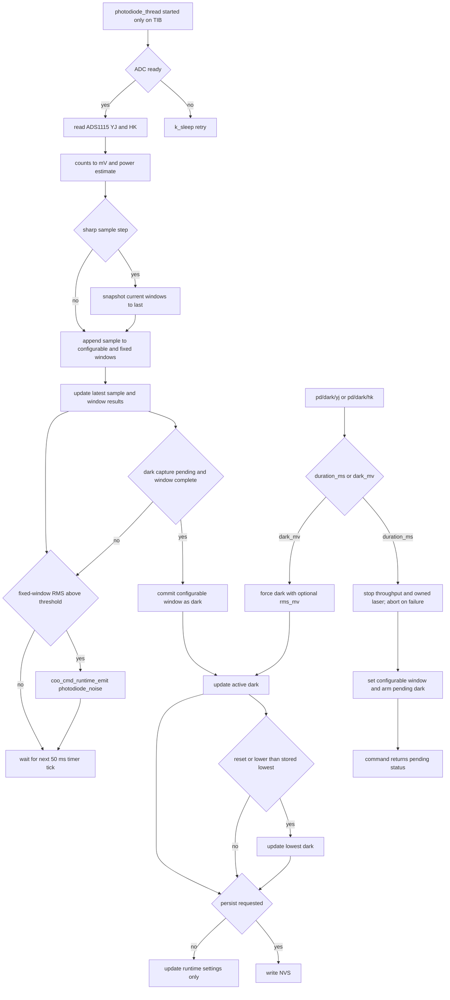
```mermaid
flowchart TD
  Thread[photodiode_thread started only on TIB] --> Adc{ADC ready}
  Adc -- no --> Sleep[k_sleep retry]
  Adc -- yes --> Sample[read ADS1115 YJ and HK]
  Sample --> Convert[counts to mV and power estimate]
  Convert --> Step{sharp sample step}
  Step -- yes --> Snapshot[snapshot current windows to last]
  Step -- no --> Windows
  Snapshot --> Windows[append sample to configurable and fixed windows]
  Windows --> Status[update latest sample and window results]
  Status --> PendingDark{dark capture pending and window complete}
  PendingDark -- yes --> DarkCommit[commit configurable window as dark]
  PendingDark -- no --> Warn
  Status --> Warn{fixed-window RMS above threshold}
  Warn -- yes --> Emit[coo_cmd_runtime_emit photodiode_noise]
  Warn -- no --> SleepPeriod
  Emit --> SleepPeriod
  SleepPeriod[wait for next 50 ms timer tick]

  DarkCmd[pd/dark/yj or pd/dark/hk] --> DarkMode{duration_ms or dark_mv}
  DarkMode -- duration_ms --> StopTP[stop throughput and owned laser; abort on failure]
  StopTP --> Arm[set configurable window and arm pending dark]
  Arm --> Query[command returns pending status]
  DarkMode -- dark_mv --> Force[force dark with optional rms_mv]
  Force --> Commit[update active dark]
  DarkCommit --> Commit
  Commit --> Lowest{reset or lower than stored lowest}
  Lowest -- yes --> LowestStore[update lowest dark]
  Lowest -- no --> Persist
  LowestStore --> Persist
  Commit --> Persist{persist requested}
  Persist -- yes --> NVS[write NVS]
  Persist -- no --> Runtime[update runtime settings only]
```

## 11. Throughput Monitor Flow

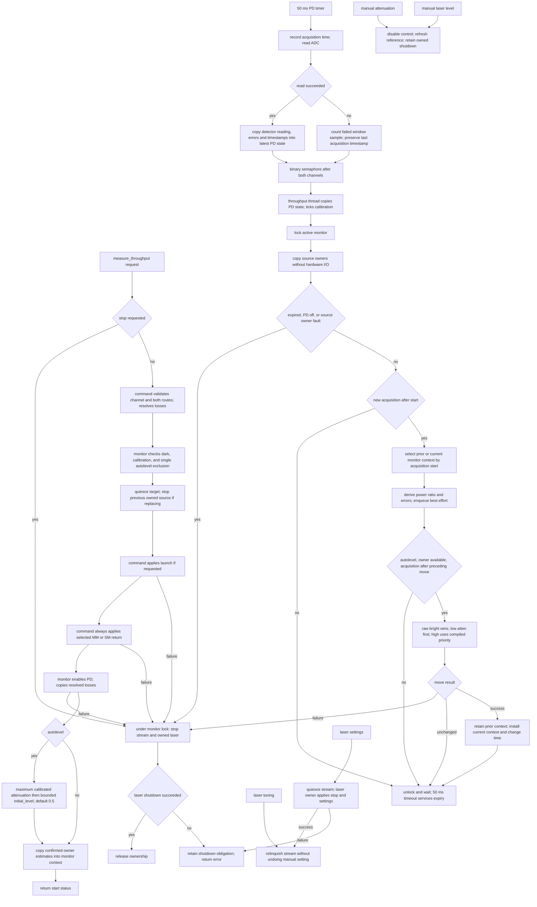
```mermaid
flowchart TD
  Command[measure_throughput request] --> Stop{stop requested}
  Stop -- yes --> Shutdown[under monitor lock: stop stream and owned laser]
  Stop -- no --> Validate[command validates channel and both routes; resolves losses]
  Validate --> Prepare[monitor checks dark, calibration, and single autolevel exclusion]
  Prepare --> Quiesce[quiesce target; stop previous owned source if replacing]
  Quiesce --> Launch[command applies launch if requested]
  Launch --> Return[command always applies selected MM or SM return]
  Return --> Start[monitor enables PD; copies resolved losses]
  Launch -- failure --> Shutdown
  Return -- failure --> Shutdown
  Start -- failure --> Shutdown
  Start --> Auto{autolevel}
  Auto -- yes --> Seed[maximum calibrated attenuation then bounded initial_level; default 0.5]
  Seed --> Ref[copy confirmed owner estimates into monitor context]
  Auto -- no --> Ref
  Ref --> Ready[return start status]
  Shutdown --> Stopped{laser shutdown succeeded}
  Stopped -- yes --> Clear[release ownership]
  Stopped -- no --> Retry[retain shutdown obligation; return error]

  Timer[50 ms PD timer] --> ADC[record acquisition time; read ADC]
  ADC --> Valid{read succeeded}
  Valid -- yes --> State[copy detector reading, errors and timestamps into latest PD state]
  Valid -- no --> Fail[count failed window sample; preserve last acquisition timestamp]
  State --> Wake[binary semaphore after both channels]
  Fail --> Wake
  Wake --> Thread[throughput thread copies PD state; ticks calibration]
  Thread --> Lock[lock active monitor]
  Lock --> Owners[copy source owners without hardware I/O]
  Owners --> Fault{expired, PD off, or source owner fault}
  Fault -- yes --> Shutdown
  Fault -- no --> Fresh{new acquisition after start}
  Fresh -- no --> Unlock[unlock and wait; 50 ms timeout services expiry]
  Fresh -- yes --> Context[select prior or current monitor context by acquisition start]
  Context --> Publish[derive power ratio and errors; enqueue best effort]
  Publish --> Control{autolevel, owner available, acquisition after preceding move}
  Control -- no --> Unlock
  Control -- yes --> Adjust[raw bright wins; low atten first; high uses compiled priority]
  Adjust --> Changed{move result}
  Changed -- failure --> Shutdown
  Changed -- unchanged --> Unlock
  Changed -- success --> Future[retain prior context; install current context and change time]
  Future --> Unlock

  AttenChange[manual attenuation] --> Disable[disable control; refresh reference; retain owned shutdown]
  LaserChange[manual laser level] --> Disable
  LaserTune[laser tuning] --> Release[relinquish stream without undoing manual setting]
  LaserSettings[laser settings] --> SettingsQuiet[quiesce stream; laser owner applies stop and settings]
  SettingsQuiet -- success --> Release
  SettingsQuiet -- failure --> Retry
```

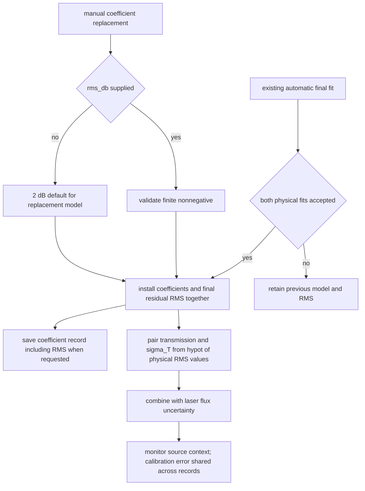
```mermaid
flowchart TD
  AutoFit[existing automatic final fit] --> Accepted{both physical fits accepted}
  Accepted -- yes --> Install[install coefficients and final residual RMS together]
  Accepted -- no --> Keep[retain previous model and RMS]
  Manual[manual coefficient replacement] --> RMS{rms_db supplied}
  RMS -- yes --> Validate[validate finite nonnegative]
  RMS -- no --> Default[2 dB default for replacement model]
  Validate --> Install
  Default --> Install
  Install --> Save[save coefficient record including RMS when requested]
  Install --> Estimate[pair transmission and sigma_T from hypot of physical RMS values]
  Estimate --> Source[combine with laser flux uncertainty]
  Source --> ADCRef[monitor source context; calibration error shared across records]
```

Notebook collection and display:

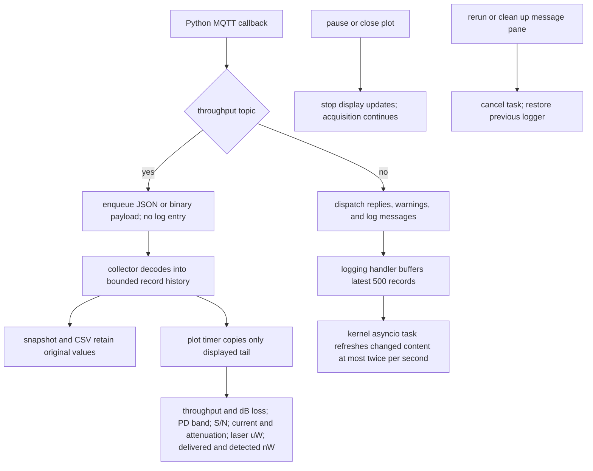
```mermaid
flowchart TD
  MQTT[Python MQTT callback] --> Kind{throughput topic}
  Kind -- yes --> Collect[enqueue JSON or binary payload; no log entry]
  Collect --> Decode[collector decodes into bounded record history]
  Decode --> CSV[snapshot and CSV retain original values]
  Decode --> Plot[plot timer copies only displayed tail]
  Plot --> Panels[throughput and dB loss; PD band; S/N; current and attenuation; laser uW; delivered and detected nW]
  Kind -- no --> Logs[dispatch replies, warnings, and log messages]
  Logs --> Buffer[logging handler buffers latest 500 records]
  Buffer --> Pane[kernel asyncio task refreshes changed content at most twice per second]
  Pause[pause or close plot] --> DisplayOnly[stop display updates; acquisition continues]
  Cleanup[rerun or clean up message pane] --> Cancel[cancel task; restore previous logger]
```

## 12. MEMS Router and Toggler Flow

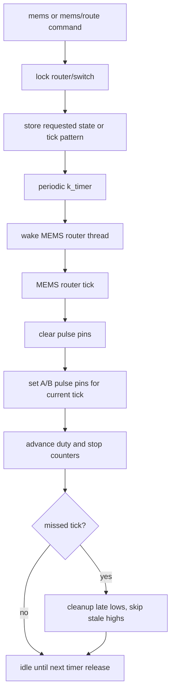
```mermaid
flowchart TD
  Command[mems or mems/route command] --> Lock[lock router/switch]
  Lock --> Target[store requested state or tick pattern]
  Target --> Timer[periodic k_timer]
  Timer --> Wake[wake MEMS router thread]
  Wake --> Tick[MEMS router tick]
  Tick --> Clear[clear pulse pins]
  Clear --> Apply[set A/B pulse pins for current tick]
  Apply --> Advance[advance duty and stop counters]
  Advance --> Missed{missed tick?}
  Missed -- no --> Idle[idle until next timer release]
  Missed -- yes --> Classify[cleanup late lows, skip stale highs]
  Classify --> Idle
```

## 13. Split Command Flow

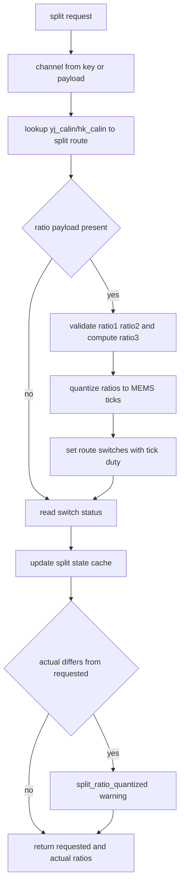
```mermaid
flowchart TD
  Split[split request] --> Channel[channel from key or payload]
  Channel --> Route[lookup yj_calin/hk_calin to split route]
  Route --> Effect{ratio payload present}
  Effect -- no --> Read[read switch status]
  Effect -- yes --> Ratios[validate ratio1 ratio2 and compute ratio3]
  Ratios --> Ticks[quantize ratios to MEMS ticks]
  Ticks --> Apply[set route switches with tick duty]
  Apply --> Read
  Read --> Cache[update split state cache]
  Cache --> Warn{actual differs from requested}
  Warn -- yes --> Emit[split_ratio_quantized warning]
  Warn -- no --> Response[return requested and actual ratios]
  Emit --> Response
```

## 14. Settings Load, Update, and Persist Flow

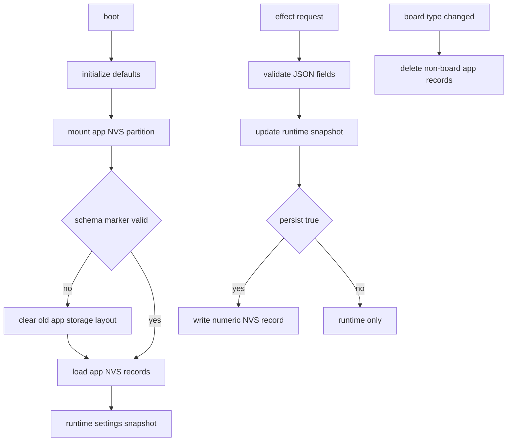
```mermaid
flowchart TD
  Boot[boot] --> Defaults[initialize defaults]
  Defaults --> Mount[mount app NVS partition]
  Mount --> Schema{schema marker valid}
  Schema -- no --> Clear[clear old app storage layout]
  Schema -- yes --> Load[load app NVS records]
  Clear --> Load
  Load --> Runtime[runtime settings snapshot]
  Command[effect request] --> Parse[validate JSON fields]
  Parse --> Update[update runtime snapshot]
  Update --> Persist{persist true}
  Persist -- yes --> Save[write numeric NVS record]
  Persist -- no --> Volatile[runtime only]
  BoardChange[board type changed] --> BoardClear[delete non-board app records]
```

## 15. Warning Publication Flow

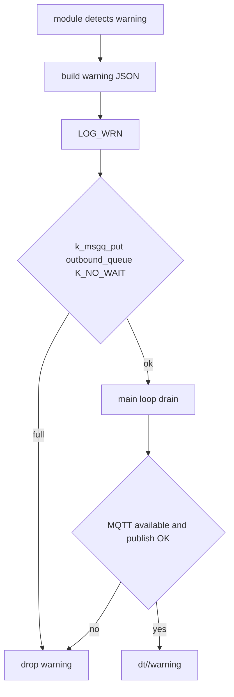
```mermaid
flowchart TD
  Emitter[module detects warning] --> Build[build warning JSON]
  Build --> Log[LOG_WRN]
  Log --> Enqueue{k_msgq_put outbound_queue K_NO_WAIT}
  Enqueue -- full --> Drop[drop warning]
  Enqueue -- ok --> Main[main loop drain]
  Main --> MQTT{MQTT available and publish OK}
  MQTT -- yes --> Topic[dt/<device>/warning]
  MQTT -- no --> Drop
```

## 16. Temperature Sensing Flow

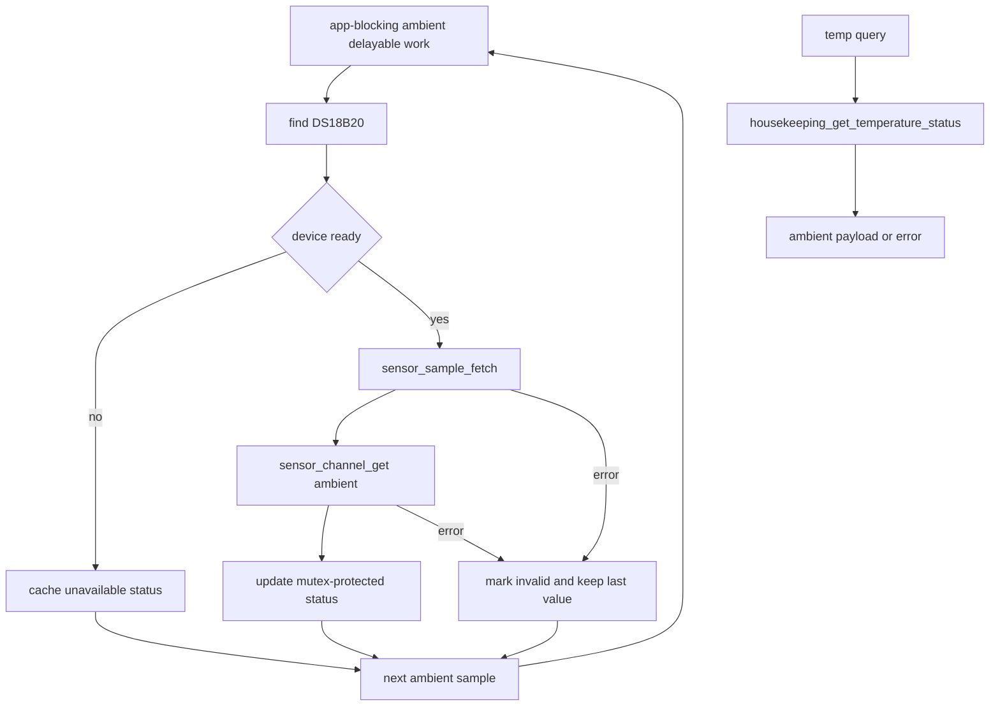
```mermaid
flowchart TD
  Work[app-blocking ambient delayable work] --> Find[find DS18B20]
  Find --> Ready{device ready}
  Ready -- no --> InitErr[cache unavailable status]
  InitErr --> Wait[next ambient sample]
  Ready -- yes --> Fetch[sensor_sample_fetch]
  Fetch --> SensorGet[sensor_channel_get ambient]
  SensorGet --> Cache[update mutex-protected status]
  SensorGet -- error --> CacheErr[mark invalid and keep last value]
  Fetch -- error --> CacheErr
  Cache --> Wait
  CacheErr --> Wait
  Wait --> Work
  Command[temp query] --> Read[housekeeping_get_temperature_status]
  Read --> Response[ambient payload or error]
```

## 17. SNTP and Time Flow

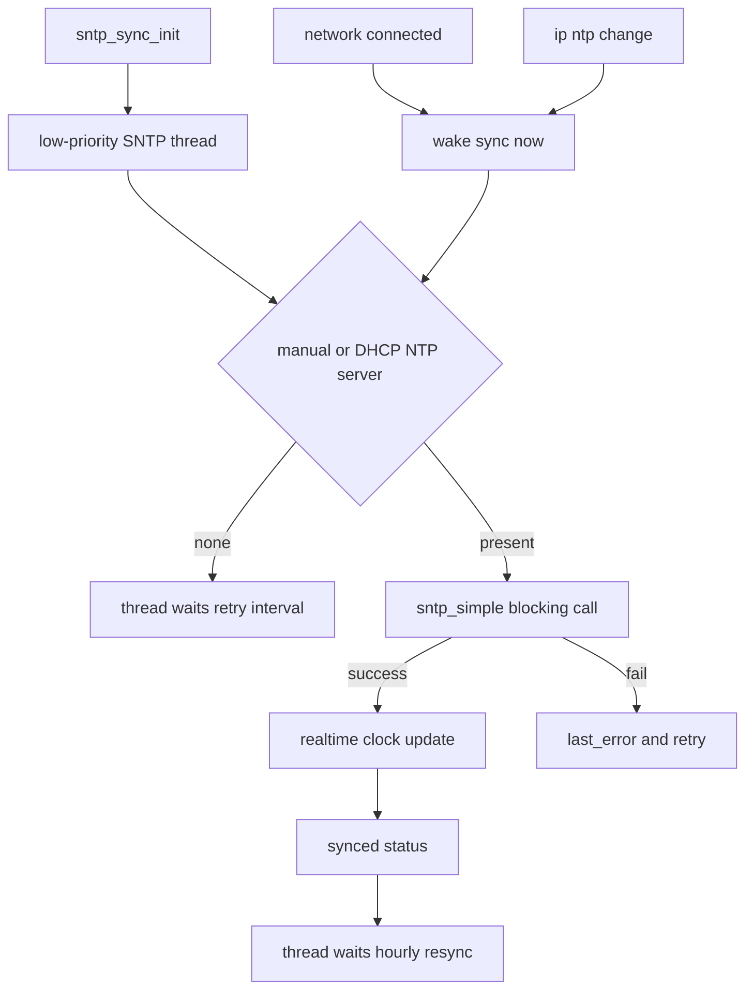
```mermaid
flowchart TD
  Init[sntp_sync_init] --> Thread[low-priority SNTP thread]
  Network[network connected] --> Wake[wake sync now]
  IPSet[ip ntp change] --> Wake
  Thread --> Server{manual or DHCP NTP server}
  Wake --> Server
  Server -- none --> Retry[thread waits retry interval]
  Server -- present --> SNTP[sntp_simple blocking call]
  SNTP -- success --> Clock[realtime clock update]
  Clock --> Status[synced status]
  Status --> Resync[thread waits hourly resync]
  SNTP -- fail --> Error[last_error and retry]
```

## 18. Watchdog Flow

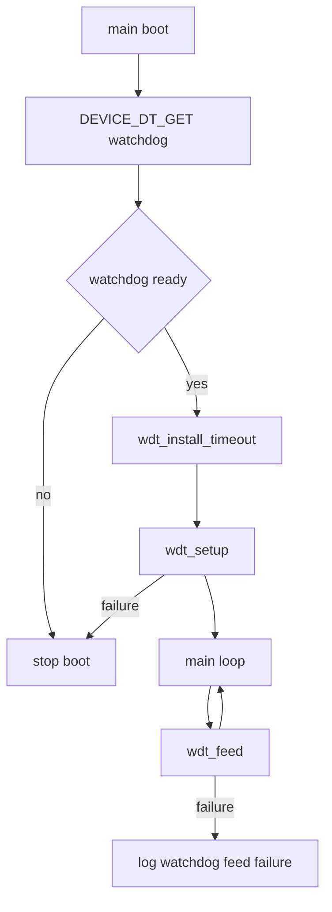
```mermaid
flowchart TD
  Boot[main boot] --> Lookup[DEVICE_DT_GET watchdog]
  Lookup --> Ready{watchdog ready}
  Ready -- no --> Stop[stop boot]
  Ready -- yes --> Install[wdt_install_timeout]
  Install --> Setup[wdt_setup]
  Setup -- failure --> Stop
  Setup --> Loop[main loop]
  Loop --> Feed[wdt_feed]
  Feed --> Loop
  Feed -- failure --> Log[log watchdog feed failure]
```

## 19. Network and MQTT Reconfiguration Flow

```mermaid
flowchart TD
  Loop[main loop] --> NetReady{network ready}
  Loop --> Revision{MQTT settings revision changed}
  Revision -- yes --> Load[load broker settings]
  Load --> Apply[coo_mqtt_set_broker_config]
  Apply -- reject --> Log[log rejected broker config]
  Apply -- ok --> Changed{broker changed}
  Changed -- yes --> SavePrior[save prior broker and arm revert-on-failure]
  SavePrior --> DisconnectOld{MQTT connected}
  Changed -- no --> NetReady
  DisconnectOld -- yes --> Disconnect[mqtt_disconnect and clear subscribed flag]
  DisconnectOld -- no --> NetReady
  Disconnect --> NetReady

  NetReady -- no --> ConnectedButBlocked{MQTT connected}
  ConnectedButBlocked -- yes --> DropConn[mqtt_disconnect]
  ConnectedButBlocked -- no --> DrainNoMqtt[drain outbound with MQTT unavailable]
  DropConn --> DrainNoMqtt
  DrainNoMqtt --> Sleep[k_sleep 20 ms]

  NetReady -- yes --> Connected{MQTT connected}
  Connected -- no --> Connect[coo_mqtt_connect]
  Connect -- success --> ClearRevert[clear revert flag]
  Connect -- failure and revert armed --> Warn[emit mqtt_broker_revert warning]
  Warn --> Restore[restore prior broker and persisted settings]
  Connect -- failure --> DrainNoMqtt
  ClearRevert --> SubscribeNeeded{subscription active}
  Connected -- yes --> SubscribeNeeded
  SubscribeNeeded -- no --> Subscribe[subscribe cmd/<device>/req/#]
  SubscribeNeeded -- yes --> Drain[drain outbound with MQTT available]
  Subscribe --> Drain
  Drain --> Process[coo_mqtt_process]
  Process -- ok --> Loop
  Process -- failure --> DisconnectProcess[mqtt_disconnect and clear subscribed flag]
  DisconnectProcess --> Loop
  Sleep --> Loop
```

## 20. Laser Bank Control Flow

```mermaid
flowchart TD
  Work[app-blocking laser-bank temp-control work] --> Cycle[run laserbank temp-control pass]
  Cycle --> Settings[read laserbank settings]
  Settings --> Ambient[read cached ambient temperature]
  Ambient --> Power[read bank power state]
  Power --> Mode{heater mode}

  Mode -- override_on --> ForceOn[set heater on]
  Mode -- override_off --> ForceOff[set heater off]
  ForceOn --> OverrideWarn[rate-limited override warning]
  ForceOff --> OverrideWarn
  OverrideWarn --> Wait

  Mode -- auto --> EnteredAuto{just entered auto and bank off}
  EnteredAuto -- yes --> PowerBank[power bank on]
  EnteredAuto -- no --> ReadTemps[read Maiman TEC temperatures]
  PowerBank --> ReadTemps
  ReadTemps --> Cache[refresh per-laser temperature cache]
  Cache --> Summarize[summarize idle TEC probes and heater state]
  Summarize --> AllStaleCold{all stale and ambient below warm minimum}
  AllStaleCold -- yes --> KeepPower[best-effort bank power on]
  AllStaleCold -- no --> HeaterPolicy
  KeepPower --> HeaterPolicy{heater policy}
  HeaterPolicy -- any disabled below 15 C --> HeaterOn[set heater on]
  HeaterPolicy -- disabled above threshold --> HeaterOff[set heater off]
  HeaterPolicy -- all TECs enabled long enough --> HeaterOff
  HeaterPolicy -- otherwise --> Wait
  HeaterOn --> Wait
  HeaterOff --> Wait

  Wait[reschedule after poll interval]
  Wake[heater command changes mode] --> Cycle
  Wait --> Cycle
```

## 21. Laser Output and Auto-Off Flow

```mermaid
flowchart TD
  Request[laser value effect request] --> Parse[validate laser name, value, autooff_s]
  Parse --> Settings[read laser channel settings]
  Settings --> StopTP[disable autolevel; keep stream and owned shutdown]
  StopTP --> SetOutput[hispec_laser_set_output_percent_autooff]
  SetOutput --> Tuned{nonzero tune offset and level > 0}
  Tuned -- yes --> Tune[apply wavelength tune using current and TEC]
  Tuned -- no --> Percent[convert percent to diode current]
  Tune --> Applied{hardware update ok}
  Percent --> Applied
  Applied -- no --> Error[return command error]
  Applied -- yes --> LevelPositive{positive level or explicit autooff_s}
  LevelPositive -- yes --> Deadline[store auto-off deadline or zero for no timeout]
  LevelPositive -- no --> Clear[preserve existing deadline at zero current]
  Deadline --> ScheduleTimeout[reschedule laser auto-off work]
  Clear --> Ok
  ScheduleTimeout --> Ok

  TimeoutActor[app-blocking laser auto-off work] --> Service[service expired auto-off deadlines]
  Service --> Expired{deadline expired}
  Expired -- no --> Wait[reschedule nearest deadline]
  Expired -- yes --> StopOutput[hispec_laser_stop_output]
  StopOutput --> DisableTec{disable_tec_at_autooff}
  DisableTec -- yes --> TecOff[stop current and TEC]
  DisableTec -- no --> CurrentOff[stop current only]
  TecOff --> Wait
  CurrentOff --> Wait
```

```mermaid
flowchart TD
  Defaults[compiled diode table] --> Noise[3 percent fractional and 1 percent of compiled maximum power floor]
  Noise --> Policy[per-laser app policy]
  NVS[validated NVS policy] --> Policy
  Command[laser/settings uncertainty update] --> Validate[validate finite nonnegative; stop stream; retain emission]
  Validate --> Policy
  Policy --> Cache[existing laser module cache under laser lock]
  Policy --> Persist[save on persist request; no Maiman programming for noise fields]
  Cache --> Estimate[estimate power and hypot fractional plus constant uncertainty]
  Estimate --> Reference[throughput acquisition reference and correlated uncertainty]
```

## 22. Status Response Assembly Flow

```mermaid
flowchart TD
  Request[status query] --> Parse[parse optional ip, lasers, attens flags]
  Parse --> Base[read firmware, boot count, board, MEMS, relay status]
  Base --> Temp[read cached ambient temperature]
  Temp --> Bank[read laserbank_tempcontrol status and bank on-time]
  Bank --> PdOn[read photodiode relay on-time]
  PdOn --> Build[append base JSON fields]

  Build --> IncludeIP{ip requested}
  IncludeIP -- yes --> IP[ip_get and embed payload]
  IncludeIP -- no --> IncludeLasers
  IP --> IncludeLasers{lasers requested}
  IncludeLasers -- yes --> LaserLoop[read each laser status over Maiman when available]
  IncludeLasers -- no --> IncludeAttens
  LaserLoop --> IncludeAttens{attens requested}
  IncludeAttens -- yes --> AttenLoop[read available attenuator channels over DAC]
  IncludeAttens -- no --> Last
  AttenLoop --> Last[append lastcommand]
  Last --> Size{fixed payload still fits}
  Size -- yes --> Response[return status payload]
  Size -- no --> Error[return status response too large]
```
